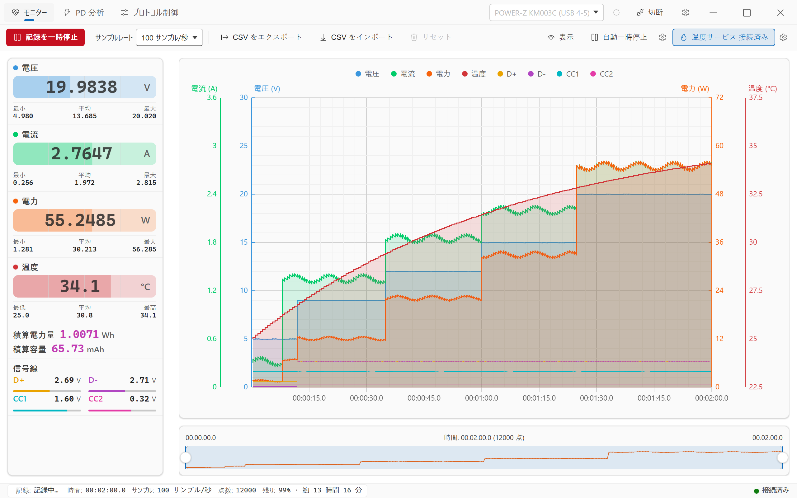
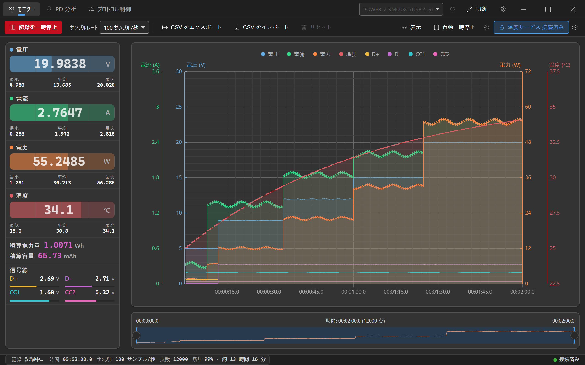
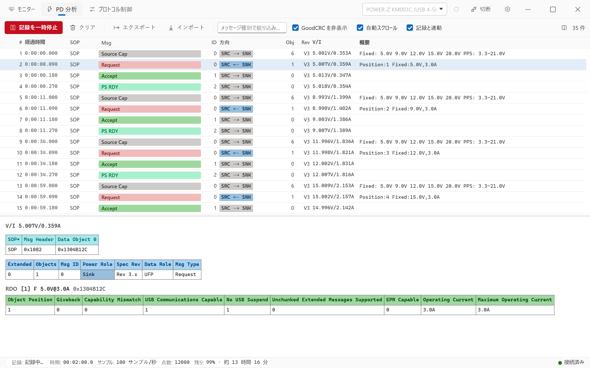
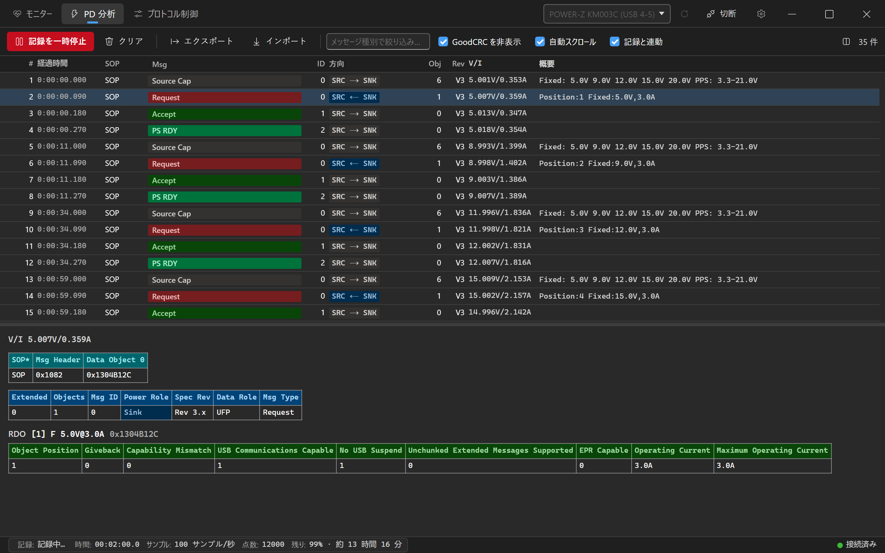
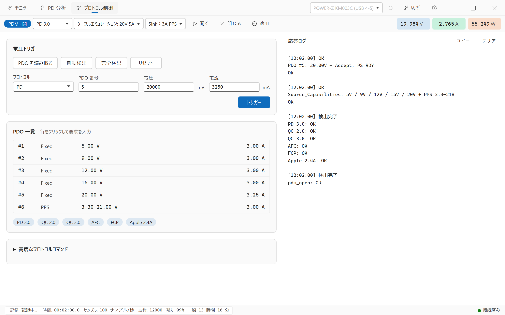
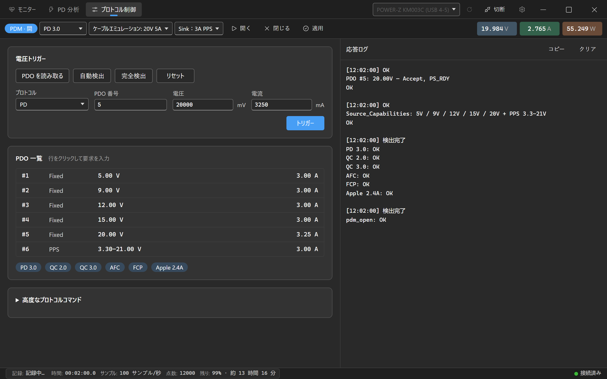
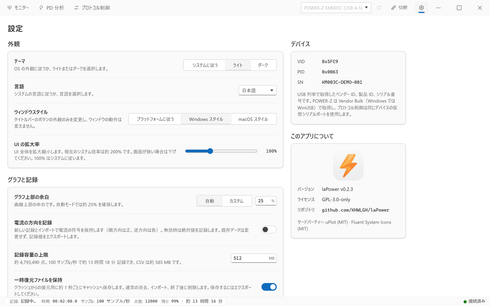
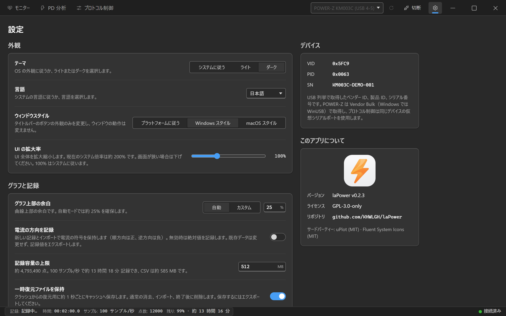

[English](README.md) | [简体中文](README.zh-CN.md) | [繁體中文](README.zh-TW.md) | **日本語**

<div align="center">


# laPower

**WITRN / POWER-Z USB 電力計用デスクトップアプリ — リアルタイム監視 · USB-PD 分析 · データ記録**

[](https://github.com/KHWLGH/laPower/releases/latest)
[](https://github.com/KHWLGH/laPower/actions/workflows/ci.yml)
[](LICENSE)
[](https://github.com/KHWLGH/laPower/stargazers)
[](https://github.com/KHWLGH/laPower/releases)
[](https://github.com/KHWLGH/laPower/commits/main)

[](https://tauri.app/)
[](https://www.rust-lang.org/)
[](https://developer.mozilla.org/docs/Web/JavaScript)
[](https://github.com/leeoniya/uPlot)
[](#-ダウンロードとインストール)

</div>

## 言語の選択

「設定 → 外観 → 言語」で、システムに従う、简体中文、繁體中文、English、日本語を選択できます。変更は即座に反映・保存され、接続、記録、データ、グラフ範囲、フィルター、選択中のメッセージを保持します。設定をリセットすると自動選択に戻ります。

Linux では LC_ALL → LC_MESSAGES → LANG の順で最初の空でない値を使用し、Windows／macOS ではネイティブのシステム locale を取得します。取得できない場合は WebView の優先言語を使い、最終的に英語へフォールバックします。地域よりも文字体系を優先し、Hans は簡体字、Hant は繁体字を選びます。それ以外では CN／SG と地域なしの zh は簡体字、TW／HK／MO は繁体字、ja は日本語、それ以外（C／POSIX を含む）は英語になります。大文字小文字、アンダースコア、文字コード・修飾子の接尾辞を正規化します。手動選択は自動検出より優先されます。

```bash
LANG=en_US.UTF-8 ./laPower.AppImage
LC_ALL=ja_JP.UTF-8 ./laPower.AppImage
env -u LC_ALL LC_MESSAGES=zh_TW.UTF-8 LANG=en_US.UTF-8 ./laPower.AppImage
```

## 📖 プロジェクトについて

laPower は WITRN USB 電力計と POWER-Z KM003C/KM002C に接続するデスクトップアプリです。USB HID または Vendor Bulk インターフェイスから測定フレームを読み取り、リアルタイム表示、長時間記録、USB-PD デコードをローカルで行います。ネットワーク接続は不要です。

**Tauri v2** を使用し、バックエンドの **Rust** がデバイス通信、USB-PD 解析、バックグラウンドスレッドのライフサイクルを担当します。フロントエンドは **標準 JavaScript ES Modules** で、リリース時に esbuild がスクリプトとスタイルをまとめ、グラフには uPlot を使います。実行時のフロントエンド依存関係はすべてリポジトリに同梱され、CDN からリソースを取得しません。

電圧・電流・電力・温度に加え、**D+ / D− / CC1 / CC2 の信号線電圧**を記録し、計器が取得した **USB-PD メッセージをフィールドごとにデコード**します。充電器が通知した PDO、デバイスが要求した PPS 電圧、ネゴシエーションが完了した時刻をミリ秒単位で確認できます。

> **プラットフォームについて：** バージョンタグから GitHub Actions が Windows x64、Linux x64、macOS Intel／Apple Silicon をパッケージ化し、チェック通過後に Release を公開します。実際の配布物は各 Release の添付ファイルを確認してください。開発と検証は主に Windows で行っており、macOS／Linux の GUI・デバイス接続と macOS 12 の互換性は実機検証が必要です。[開発とビルド](docs/ja/DEVELOPMENT.md#リリース手順)を参照してください。

> **補足：** 本ソフトウェアの多くは Claude Code、Grok Build、Codex などの AI コーディングツールで制作しており、未知の問題が残る可能性があります。[Issues](https://github.com/KHWLGH/laPower/issues) で報告してください。

## 📸 画面プレビュー

Windows 上の **0.2.3** の画面です。独立した開発ツールで生成した仮想デバイスとデータを使用し、アプリ全体のタイトルバーを含めて表示しています。ライトテーマを先に掲載しています。アプリは既定でシステムテーマに従い、開発用プレビューはライトテーマが既定です。再生成方法は[開発用プレビュー](docs/ja/DEVELOPMENT.md#開発用プレビュー)を参照してください。

| ライトテーマ | ダークテーマ |
| :---: | :---: |
| <br><sub>**モニター** · 測定値カード / 8 チャンネル・4 軸 / タイムライン</sub> | <br><sub>**モニター** · ダークテーマ</sub> |
| <br><sub>**PD 分析** · メッセージ一覧 / PDO 概要 / フィールドデコード</sub> | <br><sub>**PD 分析** · ダークテーマ</sub> |
| <br><sub>**プロトコル制御** · PDM / PDO / プロトコル検出・電圧要求</sub> | <br><sub>**プロトコル制御** · ダークテーマ</sub> |
| <br><sub>**設定** · 外観 / グラフと記録 / デバイス / このアプリについて</sub> | <br><sub>**設定** · ダークテーマ</sub> |

## ✨ 主な機能

### リアルタイム監視

- 電圧・電流・電力・温度のカードに、最小・最大・平均値を表示します。
- **積算電力量（Wh）と積算容量（mAh）**はサンプルをソフトウェアで積分して求めます。スリープ、時刻の巻き戻り、NTP による前方ジャンプで生じる時刻変動（サンプリング間隔の 8 倍を超え、かつ 2 秒以上）は 1 サンプリング周期分だけ進め、積算値の異常増加を防ぎます。
- **信号線電圧** D+ / D− / CC1 / CC2 はグラフに重ねて表示でき、CSV にも出力します。実際の分解能はデバイスに依存し、WITRN の CC1／CC2 は 0.1 V です。
- **電流方向の記録**を有効にすると符号を保持します（順方向は正、逆方向は負、K2 は ±10 A をネイティブ対応）。サイドバーに方向矢印を表示します。
- **自動一時停止：** 電圧・電流・電力がしきい値未満の状態で指定秒数続くと記録を一時停止し、無人の充放電テストに使えます。
- **POWER-Z 高速サンプリング：** KM003C/KM002C は認証後の AdcQueue で毎秒 1000 回取得します。認証失敗時は毎秒 100 回へ自動的に戻ります。
- **一時復元と上限：** 記録を約 1 秒ごとにアプリのキャッシュ内の一時ファイルへ保存し、クラッシュ復元に使用します。正常終了時に削除します。1 回の記録の既定上限は 512 MB で、到達時に自動一時停止します。長期保存用 CSV は明示的なエクスポートで作成します。

### USB-PD 分析

- SOP／SOP′ の制御・データ・拡張メッセージと Hard Reset／Cable Reset をデコードします。
- 役割と方向のバッジ（`SRC → SNK`、`SRC|SNK → Plug`）と **PDO／RDO の概要**を表示します。例：
  `Fixed: 5.0V 9.0V 12.0V 15.0V 20.0V SPR AVS: 9-15V@3.0A PPS: 5.0-21.0V`、`Position:7 PPS:8.0V,3.45A`。
- 詳細パネルでフレームを**ワード単位で分解**します。Data Object の生の 16 進値 → ヘッダーフィールド表（Extended / Objects / Msg ID / Power Role / Spec Rev / Data Role / Msg Type）→ 各 PDO の完全なビットフィールド表の順に表示します。
- メッセージ種別で絞り込んだり、全体の半数以上になりやすいリンク層確認フレーム GoodCRC を非表示にできます。
- **記録と連動**では PD キャプチャとモニターを連動させ、記録中だけ取得し、開始・一時停止・クリアを同期します。
- 増え続けるログを仮想リストで表示し、数十万件規模でもスムーズにスクロールできます。

### 高性能グラフ

- uPlot で **8 曲線・4 本の Y 軸**（電流 A、電圧 V、電力 W、温度 °C）を描画します。4 軸の目盛りを厳密に揃え、2 段階の細かい補助グリッドを備えます。
- 密なデータは増分 min/max ピクセルバケットで描画し、**100 万点でもドラッグ可能**です。履歴表示はキャンバスの実ピクセル解像度に沿って詳細を保持し、遅いフレームでもバケットを粗くせず、拡大すると元の点に戻ります。完全なデータは列形式で保持し、ホバー時は二分探索で元のサンプルを参照します。記録中もホイールで横方向にズームできます。
- 毎秒 1000 回の取得では自動描画を約 10–20 fps にし、ドラッグ・ズームは独立して更新します。取得・保存は全サンプルを保持します。記録中と停止後の履歴表示で極値インデックスを共有し、縮小・移動時の全履歴スキャンを避けます。検証範囲と限界は[性能説明](docs/PERFORMANCE.md#2026-10-04-高采样率窗口交互验收)（簡体字中国語）を参照してください。
- ツールチップに 8 チャンネルすべてを表示し、凡例で個別表示を切り替え、下部のタイムラインで範囲選択・移動ができます。
- 各曲線の塗りつぶしは不透明度で直接制御します（0 = 無効、1–100 = 有効）。

### 記録とデータ互換性

- 温度列の有無を選べる **CSV エクスポート**と**インポート**。列名で照合し、信号線列のない旧ファイルにも対応します。
- **PD キャプチャのエクスポート／インポート**はバージョン付き JSON エンベロープを使い、旧形式も読み込めます。
- 毎秒 0.1–100 回を選択でき、POWER-Z は毎秒 1000 回にも対応します。バックエンドは 1–60000 ms を受け付け、実際の下限はデバイスに依存します。

### インターフェイス

- タブ式ワークスペース（モニター／PD 分析／プロトコル制御／設定）と常設のタイトルバー接続欄で、どの画面からも接続・切断できます。プロトコル制御は POWER-Z 接続時のみ表示します。
- **システムに従う／ライト／ダーク**の 3 テーマで、既定はシステムに従います。デザイントークンは Fluent UI webDark／webLight に合わせています。
- **UI スケール 50–200%**。OS の拡大率で画面が窮屈な場合は縮小できます。
- macOS は標準ウィンドウボタンでフルスクリーン、タイル表示、最小化を操作できます。Windows は Windows 11 のスナップレイアウトを保持し、Windows／Linux ではボタンの外観を Windows／macOS スタイルから選択できます。

## 📱 対応デバイス

| モデル | VID | PID |
| --- | --- | --- |
| WITRN K2 | `0x0716` | `0x5060` |
| WITRN U3 | `0x0716` | `0x5063`、`0x5044` |
| WITRN C5 | `0x0716` | `0x5053`、`0x5064` |
| POWER-Z KM003C | `0x5FC9` | `0x0063` |
| POWER-Z KM002C | `0x5FC9` | `0x0061` |

WITRN はベンダー VID `0x0716` で列挙するため、**表にないモデルやファームウェアの派生版も一覧に表示**されます（「不明な WITRN デバイス (0716:XXXX)」）。測定できるかはファームウェアのレポート構造が互換であるかに依存します。POWER-Z は `0x5FC9` の Vendor Bulk インターフェイスで別途列挙します。

同じ物理デバイスに複数の HID インターフェイスがある場合、ベンダー定義 Usage Page を優先します。取得できた USB トポロジーポートは `WITRN K2 (USB 4-4)` のように名前へ付加します。

## 📦 ダウンロードとインストール

旧プロジェクト名は WITRN-RS です。laPower のアプリ識別子は `io.github.khwlgh.lapower` で、設定・キャッシュディレクトリを独立させています。旧設定は自動移行しませんが、既存 CSV と PD キャプチャは読み込めます。

**Windows 10／11（x64）** — [Releases](https://github.com/KHWLGH/laPower/releases/latest) から `.msi` または `.exe`（NSIS）をダウンロードしてインストールします。WITRN は OS 標準 USB HID、POWER-Z は OS 標準 HID／WinUSB を使い、通常は Windows が自動で関連付けるため追加ドライバーは不要です。

Windows インストーラーには現在証明書署名がなく、初回起動時に SmartScreen が表示される場合があります。

**macOS 12+** — Intel Mac は `macos-x64`、Apple Silicon（M1 以降）は `macos-arm64` の `.dmg` を選び、開いて `laPower.app` を Applications へドラッグします。ad-hoc 署名のみで Developer ID 署名・Apple 公証はありません。Gatekeeper が初回起動をブロックした場合は「システム設定 → プライバシーとセキュリティ」で開くことを許可してください。macOS 12 はビルド対象であり、旧 OS の互換性には実機検証が必要です。過去の検証範囲は [macOS ARM64 ビルド記録](docs/MACOS_BUILD.md)（簡体字中国語）を参照してください。

**Linux（x64）** — `linux-x64` の `.deb`、`.rpm`、`.AppImage` を選びます。Debian／Ubuntu は `sudo apt install ./laPower_<version>_linux-x64.deb`、Fedora などは `sudo dnf install ./laPower_<version>_linux-x64.rpm` でインストールできます。AppImage は `chmod +x ./laPower_<version>_linux-x64.AppImage` の後に実行します。ディストリビューションによって FUSE 2 ランタイムが必要です。Ubuntu 22.04 でビルドしており、すべてのディストリビューションへの対応は保証しません。

Linux パッケージはデバイス権限を自動設定しません。接続前に [udev ルール](docs/ja/DEVELOPMENT.md#udev-ルール必須)を設定してください。未設定では検出・接続できない場合があります。Release の `SHA256SUMS` で 7 個のインストールパッケージを検証できます。

## 🚀 クイックスタート

1. **接続** — 計器を挿し、タイトルバーのデバイス一覧横の更新ボタンでスキャンし、対象を選んで `接続` をクリックします。
2. **記録** — `モニター` タブで `記録開始` をクリックします。カードとグラフが更新され、電力量・容量も積算します（一時停止中は加算しません）。
3. **PD キャプチャ** — `PD 分析` へ移動します。既定で `記録と連動` が有効で、モニターの開始・一時停止と同期します。**充電器を挿し直す瞬間のハンドシェイクが特に有用です。**
4. **エクスポート** — `モニター` で `CSV をエクスポート` → `温度あり`／`温度なし` を選びます。PD は `PD 分析` の `エクスポート` で別の JSON として保存します。

全画面の説明、各設定、ファイル形式は[使用ガイド](docs/ja/USAGE.md)を参照してください。

## 📚 ドキュメント

| ドキュメント | 内容 |
| --- | --- |
| [使用ガイド](docs/ja/USAGE.md) | 各操作・全設定、CSV／PD キャプチャ形式、よくある質問 |
| [技術アーキテクチャ](docs/ARCHITECTURE.md)（簡体字中国語） | スレッドモデル、Tauri コマンド、データフロー、HID 構造、テスト・セキュリティ境界 |
| [開発とビルド](docs/ja/DEVELOPMENT.md) | 環境、ビルドコマンド、CI、Linux／macOS ビルド、貢献方法 |
| [macOS ARM64 ビルド記録](docs/MACOS_BUILD.md)（簡体字中国語） | Apple Silicon パッケージ化、ad-hoc 署名、DMG、検証範囲 |
| [性能ベンチマークと限界](docs/PERFORMANCE.md)（簡体字中国語） | グラフスケジューリング、データ完全性、性能測定、実機検証記録 |
| [外部温度サービス](docs/ja/TEMPERATURE.md) | TCP プロトコル、アプリの設定、Python サーバー例 |
| [変更履歴](CHANGELOG.md)（簡体字中国語） | 全バージョンの履歴 |

## 🙏 謝辞と関連プロジェクト

- USB-PD キャプチャハードウェアを提供する WITRN、POWER-Z に感謝します。
- WITRN HID 実装を提供した [JohnScotttt](https://github.com/JohnScotttt) に感謝します。
- POWER-Z Bulk、認証、AdcQueue を公開研究した [km003c-protocol-research](https://github.com/okhsunrog/km003c-protocol-research) に感謝します。
- すべてのオープンソース貢献者に感謝します。

### プロトコルライブラリ

ワークスペース内のプロトコル crate は、Tauri に依存しない独立した Rust ライブラリ（`publish = false`）です。

- **`crates/witrn-hid`** — WITRN HID デバイスのラッパーと測定フレーム解析。
- **`crates/usbpd-parser`** — USB-PD デコードとフィールドツリー。
- **`crates/km003c`** — POWER-Z Vendor Bulk、AES 認証、AdcQueue、CDC 制御。

## 📄 ライセンス

コンポーネントごとにライセンスを分けています。

| コンポーネント | ライセンス |
| --- | --- |
| アプリ本体（`src-tauri`、`src`） | [GPL-3.0-only](LICENSE) |
| プロトコルライブラリ `crates/usbpd-parser`、`crates/witrn-hid`、`crates/km003c` | LGPL-3.0-or-later |

プロトコル crate は他プロジェクトで再利用しやすい LGPL を採用しています。ルートの [`LICENSE`](LICENSE) は GPLv3 全文です。LGPL-3.0 全文は [GNU 公式サイト](https://www.gnu.org/licenses/lgpl-3.0)を参照してください。

第三者コンポーネント：uPlot (MIT) · Fluent System Icons (MIT)

## 🔗 関連リンク

- [問題・提案の報告](https://github.com/KHWLGH/laPower/issues)
- [WITRN 公式サイト](https://www.witrn.com/)
- [Tauri 公式ドキュメント](https://tauri.app/)
- [Rust 公式サイト](https://www.rust-lang.org/)
