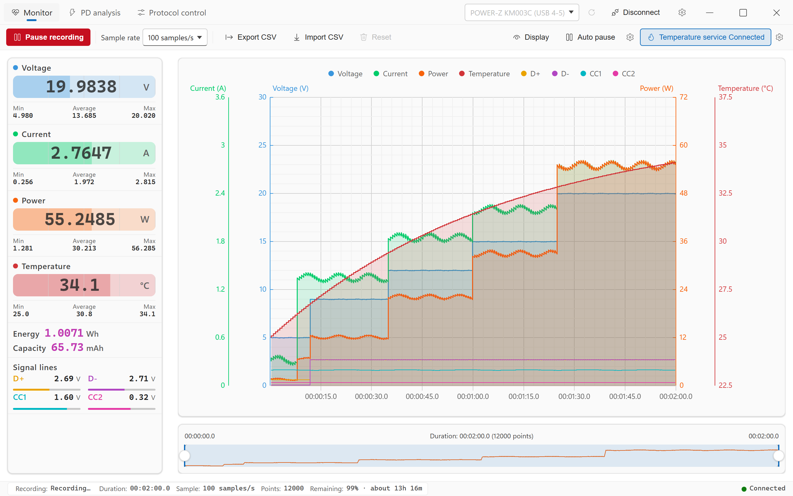
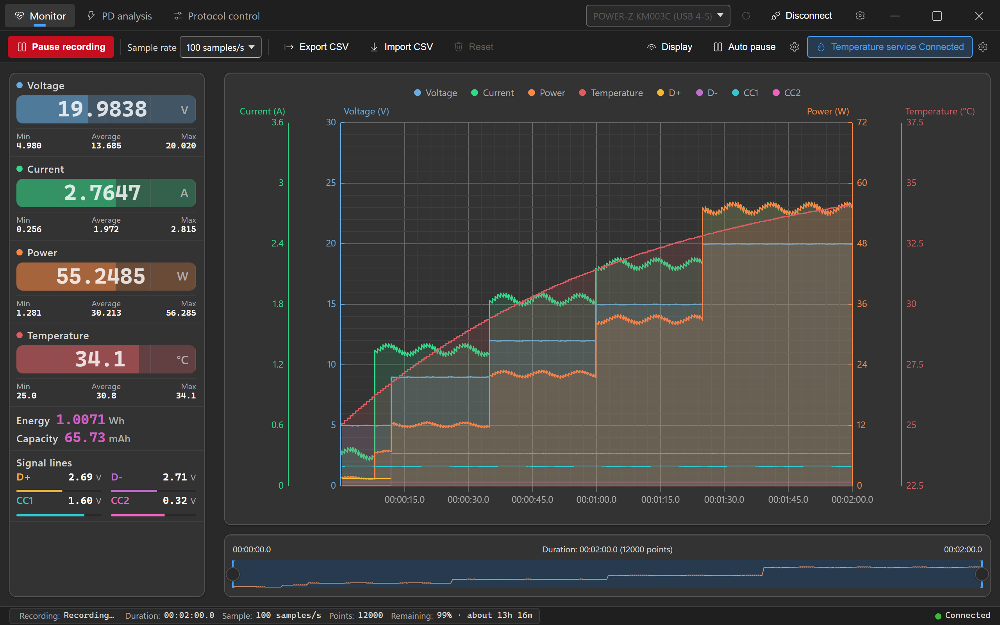
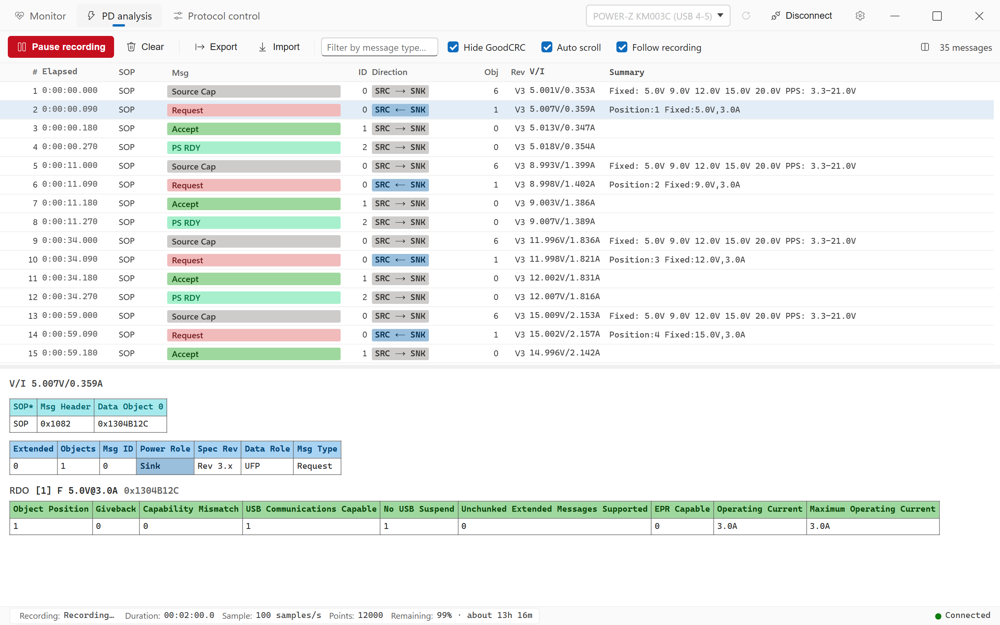
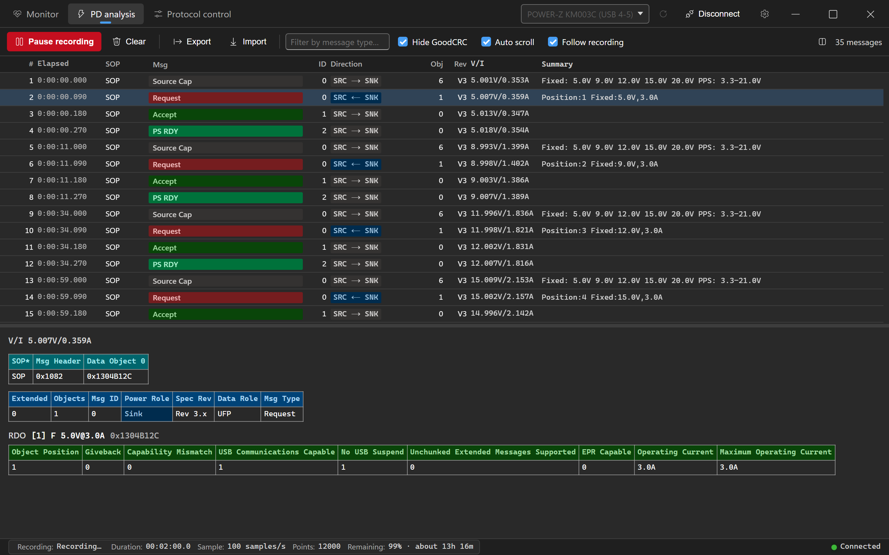
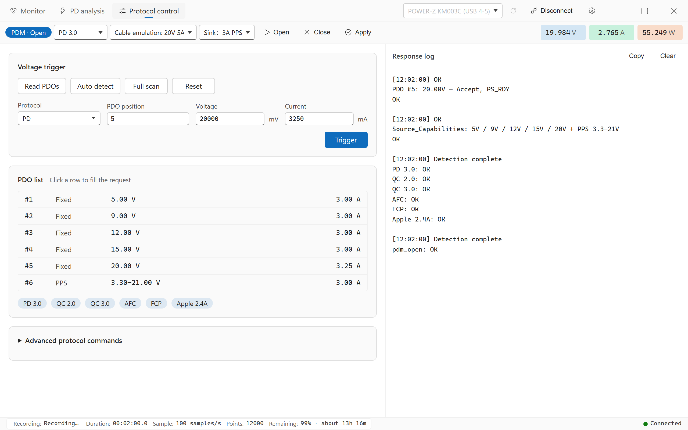
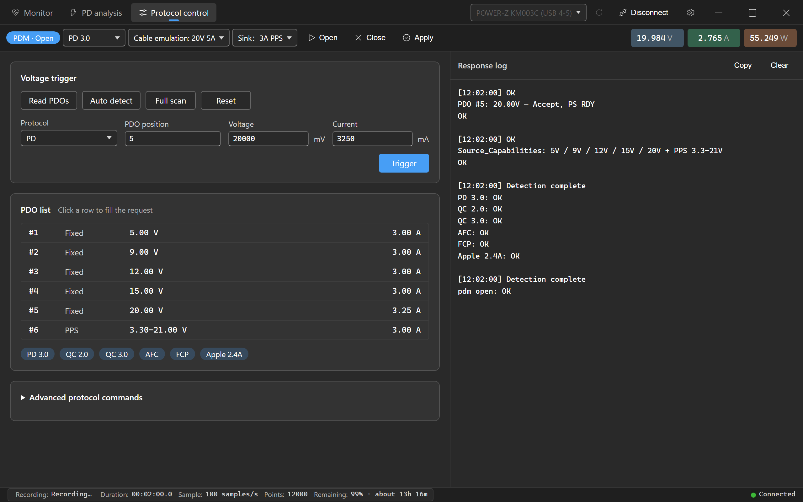
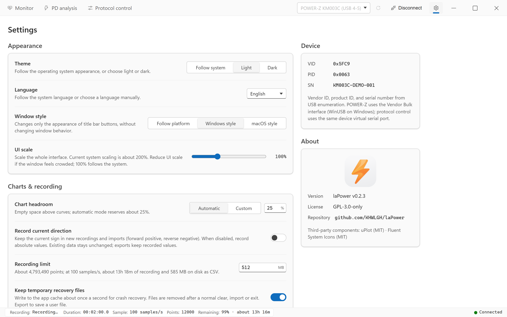
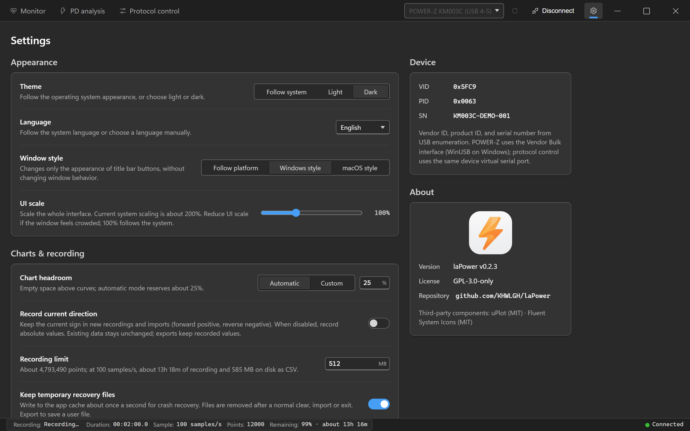

**English** | [简体中文](README.zh-CN.md) | [繁體中文](README.zh-TW.md) | [日本語](README.ja.md)

<div align="center">


# laPower

**Desktop companion for WITRN / POWER-Z USB power meters — live monitoring · USB-PD analysis · data recording**

[](https://github.com/KHWLGH/laPower/releases/latest)
[](https://github.com/KHWLGH/laPower/actions/workflows/ci.yml)
[](LICENSE)
[](https://github.com/KHWLGH/laPower/stargazers)
[](https://github.com/KHWLGH/laPower/releases)
[](https://github.com/KHWLGH/laPower/commits/main)

[](https://tauri.app/)
[](https://www.rust-lang.org/)
[](https://developer.mozilla.org/docs/Web/JavaScript)
[](https://github.com/leeoniya/uPlot)
[](#-download-and-installation)

</div>

## Language selection

In **Settings → Appearance → Language**, choose Follow system, 简体中文, 繁體中文, English or 日本語. Changes take effect immediately and are saved, preserving the connection, recording, data, chart range, filters and selected message. Resetting settings restores automatic selection.

Linux uses the first non-empty variable in LC_ALL → LC_MESSAGES → LANG order; Windows/macOS use the native system locale. If native detection is unavailable, the WebView preferred language is used, with English as the final fallback. Hans selects Simplified Chinese and Hant Traditional Chinese before considering regions; otherwise CN/SG and bare zh select Simplified Chinese, TW/HK/MO Traditional Chinese, and ja Japanese. All other locales, including C/POSIX, select English. Case, underscores, encoding and modifier suffixes are normalized. Manual selection overrides detection.

```bash
LANG=en_US.UTF-8 ./laPower.AppImage
LC_ALL=ja_JP.UTF-8 ./laPower.AppImage
env -u LC_ALL LC_MESSAGES=zh_TW.UTF-8 LANG=en_US.UTF-8 ./laPower.AppImage
```

## 📖 About the project

laPower is a desktop companion for WITRN USB power meters and POWER-Z KM003C/KM002C. It reads measurement frames through USB HID or a vendor Bulk interface and handles live display, long recordings and USB-PD decoding locally, without a network connection.

Built on **Tauri v2**, it uses **Rust** for device communication, USB-PD parsing and background thread lifecycles. The frontend is **plain JavaScript ES Modules**, bundled with its styles by esbuild for release, with uPlot charts. All runtime frontend dependencies are vendored in the repository; no resources are loaded from a CDN at runtime.

Besides voltage, current, power and temperature, laPower records **D+ / D− / CC1 / CC2 signal voltages** and **decodes captured USB-PD messages field by field**. You can inspect the PDOs advertised by a charger, the PPS voltage requested by a device, and the millisecond at which negotiation completes.

> **Platforms:** Version tags trigger GitHub Actions packages for Windows x64, Linux x64, macOS Intel and Apple Silicon, followed by a Release after checks pass. Refer to the actual assets attached to each release. Development and verification primarily take place on Windows; macOS/Linux GUI, device connections and macOS 12 compatibility still require real-machine acceptance. See [Development and build](docs/en/DEVELOPMENT.md#release-process).

> **Note:** Much of this software was made with AI coding tools such as Claude Code, Grok Build and Codex, and unknown issues may remain. Please report problems through [Issues](https://github.com/KHWLGH/laPower/issues).

## 📸 Interface preview

These images show version **0.2.3** on Windows and use simulated devices and data generated by a separate development tool, with the full application title bar retained and light mode shown first. The app follows the system theme by default; the showcase defaults to light mode. See [Development showcase](docs/en/DEVELOPMENT.md#development-showcase) to regenerate them.

| Light theme | Dark theme |
| :---: | :---: |
| <br><sub>**Monitor** · Live cards / 8 channels and 4 axes / timeline navigator</sub> | <br><sub>**Monitor** · Dark theme</sub> |
| <br><sub>**PD analysis** · Message list / PDO summaries / field decoding</sub> | <br><sub>**PD analysis** · Dark theme</sub> |
| <br><sub>**Protocol control** · PDM / PDO / protocol detection and voltage requests</sub> | <br><sub>**Protocol control** · Dark theme</sub> |
| <br><sub>**Settings** · Appearance / charts and recording / device / about</sub> | <br><sub>**Settings** · Dark theme</sub> |

## ✨ Features

### Live monitoring

- Voltage, current, power and temperature cards, each with minimum, maximum and average values.
- **Integrated energy (Wh) and capacity (mAh)** are calculated from samples in software. Host clock jumps caused by sleep, a backward adjustment or a forward NTP adjustment (over eight sampling intervals and at least two seconds) advance integration by only one sampling cycle.
- **Signal voltages** D+ / D− / CC1 / CC2 can be overlaid on the chart and exported in CSV. Actual resolution depends on the device; WITRN CC1/CC2 resolution is 0.1 V.
- Optional **signed current recording** preserves direction: positive forward current and negative reverse current, with native ±10 A support on K2. Arrows indicate direction in the sidebar.
- **Auto pause** pauses recording when voltage/current/power remains below a threshold for a specified duration, useful for unattended charge/discharge tests.
- **POWER-Z high-rate sampling:** authenticated AdcQueue sampling at 1000 samples/s on KM003C/KM002C; failed authentication falls back to 100 samples/s.
- **Temporary recovery and limits:** recording is written about once per second to temporary files in the app cache for crash recovery. Normal exit removes them. The default per-recording limit is 512 MB, with automatic pause at the limit. Explicit export creates a long-term CSV file.

### USB-PD analysis

- Decode SOP/SOP′ control, data and extended messages, plus Hard Reset/Cable Reset.
- Role-direction badges (`SRC → SNK`, `SRC|SNK → Plug`) and **PDO/RDO summaries**, for example
  `Fixed: 5.0V 9.0V 12.0V 15.0V 20.0V SPR AVS: 9-15V@3.0A PPS: 5.0-21.0V` or `Position:7 PPS:8.0V,3.45A`.
- Details unpack each frame **word by word**: raw Data Object hex → header fields (Extended / Objects / Msg ID / Power Role / Spec Rev / Data Role / Msg Type) → full bit-field tables for each PDO.
- Filter by message type or hide GoodCRC, the link-layer acknowledgement that often accounts for more than half the messages.
- **Follow recording** links PD capture with monitoring: capture only during recording, synchronize start/pause and clear both views together.
- A virtualized list keeps growing message logs scrollable even at hundreds of thousands of entries.

### High-performance charts

- uPlot draws **8 curves and 4 Y axes** (current A, voltage V, power W, temperature °C) with strictly aligned ticks and two levels of dense minor grids.
- Dense data uses incremental min/max pixel buckets, keeping **million-point histories draggable**. History rendering preserves detail at the canvas pixel resolution; slow frames do not widen buckets, and zoom restores original points. Full data stays in column storage; hover retrieves original samples by binary search. Mouse-wheel horizontal zoom also works during recording.
- At 1000 samples/s, automatic drawing runs at about 10–20 fps while dragging/zooming refresh independently. Acquisition and saving retain every sample. Recording and history browsing share the historical extrema index, avoiding a full-history scan when zooming out or panning. See [Performance notes](docs/PERFORMANCE.md#2026-10-04-高采样率窗口交互验收) (Simplified Chinese) for verified scope and limits.
- Tooltips show all eight channels; the legend toggles each channel; the bottom timeline navigator selects ranges and pans them.
- Each curve's fill is controlled directly by opacity (0 = off; 1–100 = on).

### Recording and interoperability

- **CSV export**, with or without temperature, and **import**. Import matches column names and accepts legacy files without signal-voltage columns.
- **PD capture export/import** uses a versioned JSON envelope and still reads older formats.
- Select 0.1–100 samples/s; POWER-Z also supports 1000 samples/s. The backend accepts 1–60000 ms intervals, subject to device limits.

### Interface

- Tabbed workspaces (Monitor / PD analysis / Protocol control / Settings), with device connection always available in the title bar. Protocol control appears only for connected POWER-Z devices.
- **Follow system / Light / Dark** themes, defaulting to the system, with design tokens aligned to Fluent UI webDark/webLight.
- **UI scale 50–200%** to reduce crowding when system scaling is large.
- macOS uses native window controls for full screen, tiling and minimization. Windows retains the Windows 11 Snap Layouts flyout; Windows/Linux support Windows and macOS button styles.

## 📱 Supported devices

| Model | VID | PID |
| --- | --- | --- |
| WITRN K2 | `0x0716` | `0x5060` |
| WITRN U3 | `0x0716` | `0x5063`, `0x5044` |
| WITRN C5 | `0x0716` | `0x5053`, `0x5064` |
| POWER-Z KM003C | `0x5FC9` | `0x0063` |
| POWER-Z KM002C | `0x5FC9` | `0x0061` |

WITRN enumeration uses vendor VID `0x0716`, so **models and firmware variants absent from this table also appear in the selector**, as “Unknown WITRN device (0716:XXXX)”. Measurements work only if their firmware uses a compatible report layout. POWER-Z devices are enumerated separately through the `0x5FC9` Vendor Bulk interface.

For multiple HID interfaces on one physical device, the backend prefers a vendor-defined Usage Page. Device names include a USB topology port when available, such as `WITRN K2 (USB 4-4)`.

## 📦 Download and installation

The project was formerly named WITRN-RS. laPower uses the identifier `io.github.khwlgh.lapower` and separate settings/cache directories, without automatic migration of old settings. Existing CSV and PD capture files remain importable.

**Windows 10/11 (x64)** — Download an `.msi` or `.exe` (NSIS) installer from [Releases](https://github.com/KHWLGH/laPower/releases/latest), install and run. WITRN uses system USB HID; POWER-Z uses system HID/WinUSB, which Windows generally binds automatically without extra drivers.

Windows installers currently lack certificate signing and may trigger SmartScreen on first launch.

**macOS 12+** — For Intel choose a `macos-x64` `.dmg`; for Apple Silicon (M1 or later), choose `macos-arm64`. Open it and drag `laPower.app` to Applications. Builds use ad-hoc signing without Developer ID or Apple notarization. If Gatekeeper blocks the first launch, allow it in System Settings → Privacy & Security. macOS 12 is the build target; older-system compatibility still requires real-machine verification. See [macOS ARM64 build records](docs/MACOS_BUILD.md) (Simplified Chinese) for historical verification limits.

**Linux (x64)** — Download a `linux-x64` `.deb`, `.rpm` or `.AppImage`. On Debian/Ubuntu use `sudo apt install ./laPower_<version>_linux-x64.deb`; on RPM distributions such as Fedora use `sudo dnf install ./laPower_<version>_linux-x64.rpm`. For AppImage, run `chmod +x ./laPower_<version>_linux-x64.AppImage`, then launch it directly. Your distribution may require the FUSE 2 runtime. Packages are built on Ubuntu 22.04 and are not guaranteed to work on every distribution.

Linux packages do not configure device permissions automatically. Set up the [udev rules](docs/en/DEVELOPMENT.md#udev-rules-required) before connecting a meter, or scanning/opening it may fail. The release `SHA256SUMS` verifies all seven installer packages.

## 🚀 Quick start

1. **Connect** — Plug in the meter, refresh the title-bar device selector, select the target and click `Connect`.
2. **Record** — Click `Start recording` in `Monitor`. Cards and charts update immediately; energy/capacity integration runs alongside recording and excludes pauses.
3. **Capture PD** — Open `PD analysis`. `Follow recording` is on by default and synchronizes start/pause with monitoring. **The charger connection handshake is particularly informative.**
4. **Export** — In `Monitor`, choose `Export CSV` → `With temperature` or `Without temperature`. Save PD messages separately as JSON with `Export` in `PD analysis`.

See the [User guide](docs/en/USAGE.md) for the complete interface, settings and file formats.

## 📚 Documentation

| Document | Contents |
| --- | --- |
| [User guide](docs/en/USAGE.md) | Every interface control, all settings, CSV/PD capture formats and FAQs |
| [Architecture](docs/ARCHITECTURE.md) (Simplified Chinese) | Thread model, Tauri commands, data flow, HID layouts, tests and security boundaries |
| [Development and build](docs/en/DEVELOPMENT.md) | Requirements, build commands, CI gates, Linux/macOS builds and contributions |
| [macOS ARM64 build records](docs/MACOS_BUILD.md) (Simplified Chinese) | Apple Silicon packaging, ad-hoc signing, DMG and acceptance limits |
| [Performance benchmarks and limits](docs/PERFORMANCE.md) (Simplified Chinese) | Chart scheduling, data integrity, measurements and hardware acceptance records |
| [External temperature service](docs/en/TEMPERATURE.md) | TCP protocol, app configuration and Python example server |
| [Changelog](CHANGELOG.md) (Simplified Chinese) | Full version history |

## 🙏 Credits and related projects

- Thanks to WITRN and POWER-Z for USB-PD capture hardware support.
- Thanks to [JohnScotttt](https://github.com/JohnScotttt) for the WITRN HID implementation.
- Thanks to [km003c-protocol-research](https://github.com/okhsunrog/km003c-protocol-research) for public research on POWER-Z Bulk, authentication and AdcQueue.
- Thanks to all open-source contributors.

### Protocol libraries

The workspace protocol crates are standalone Rust libraries (`publish = false`) without a Tauri dependency:

- **`crates/witrn-hid`** — WITRN HID device wrapper and measurement frame parsing.
- **`crates/usbpd-parser`** — USB-PD decoding and field trees.
- **`crates/km003c`** — POWER-Z Vendor Bulk, AES authentication, AdcQueue and CDC control.

## 📄 License

The project uses separate licenses for its components:

| Component | License |
| --- | --- |
| Application (`src-tauri`, `src`) | [GPL-3.0-only](LICENSE) |
| Protocol libraries `crates/usbpd-parser`, `crates/witrn-hid`, `crates/km003c` | LGPL-3.0-or-later |

The protocol crates use LGPL to facilitate reuse in other projects. The root [`LICENSE`](LICENSE) contains the full GPLv3 text; the full LGPL-3.0 text is on the [GNU website](https://www.gnu.org/licenses/lgpl-3.0).

Third-party components: uPlot (MIT) · Fluent System Icons (MIT)

## 🔗 Related links

- [Report an issue or suggestion](https://github.com/KHWLGH/laPower/issues)
- [WITRN website](https://www.witrn.com/)
- [Tauri documentation](https://tauri.app/)
- [Rust website](https://www.rust-lang.org/)
