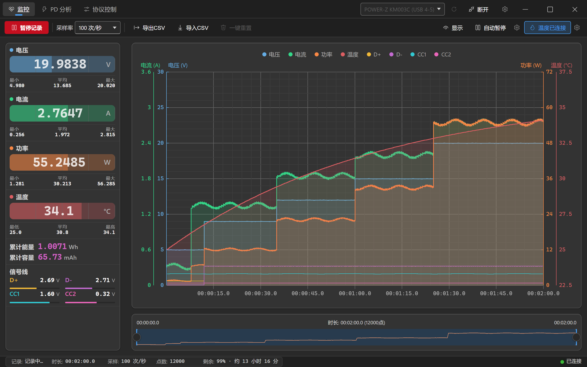
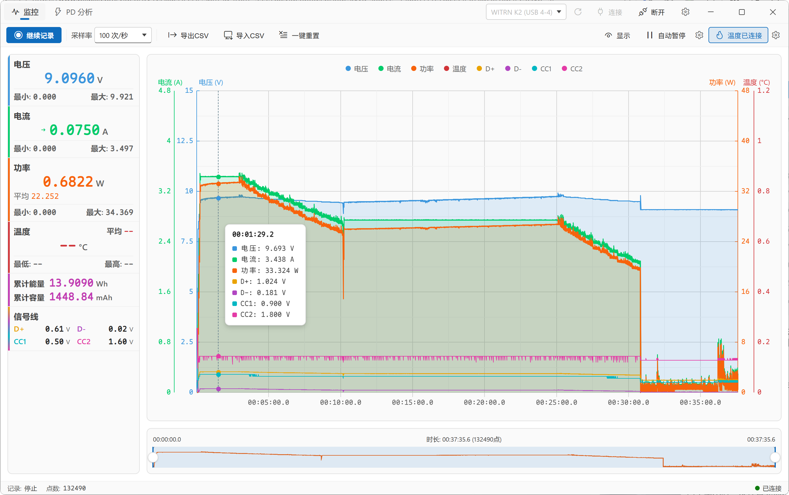
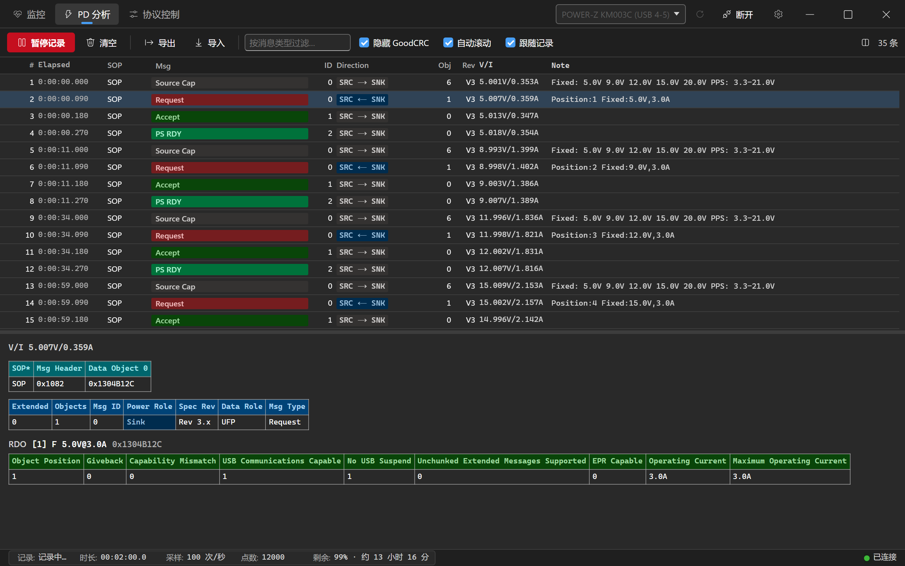
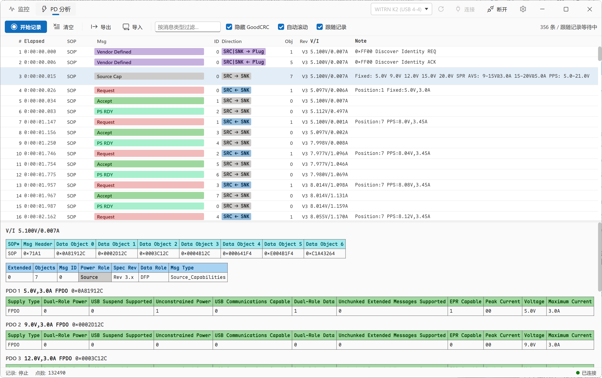
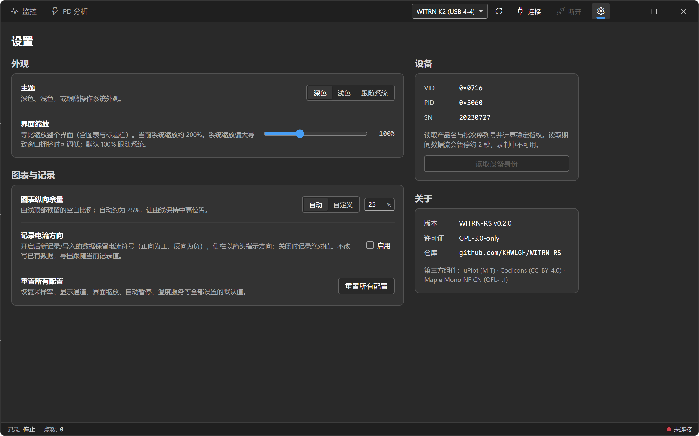
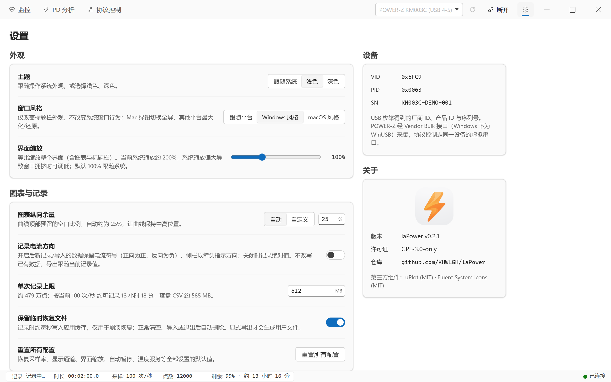

# WITRN-RS

**维简 (WITRN) USB 电压电流表的桌面上位机 —— 实时监控 · USB-PD 协议分析 · 数据记录**

## 📖 项目简介

WITRN-RS 是一个连接维简 (WITRN) USB 电压电流表的桌面上位机。它通过 USB HID 直接读取仪表的测量帧，在本地完成实时显示、长时间记录与 USB-PD 协议解码，全程不需要网络。

技术上基于 **Tauri v2**：后端是 **Rust**（HID 通信、USB-PD 解析、后台线程生命周期），前端是**不经打包器的原生 JavaScript ES Modules**，图表用 uPlot。所有前端依赖都已 vendor 进仓库，运行时不从 CDN 加载任何资源。

除了常规的电压 / 电流 / 功率 / 温度，WITRN-RS 还会记录 **D+ / D− / CC1 / CC2 四条信号线电压**，并把仪表捕获到的 **USB-PD 报文逐字段解码**——这是它和一般图表软件的主要区别：你可以直接看到充电器广播了哪些 PDO、设备请求了哪一档 PPS 电压、以及协商在第几毫秒完成。

> **平台说明：** 预构建安装包目前**仅提供 Windows**（MSI / NSIS）。项目在 Windows 上开发与验证；Linux 可自行编译，但未经持续验证，详见 [开发与构建](docs/DEVELOPMENT.md#-linux-自行编译)。

> **提示：** 本软件大部分使用 Claude Code、Grok Build、Codex 等 VibeCoding 工具制作，可能存在未知问题。欢迎通过 [Issues](https://github.com/KHWLGH/WITRN-RS/issues) 反馈。

## 📸 界面预览

| 深色主题 | 浅色主题 |
| :---: | :---: |
|  **监控** · 实时读数卡 / 8 通道 4 轴图表 / 时间线导航器 |  **监控** · 浅色主题 |
|  **PD 分析** · 报文列表 / PDO 速览 / 逐字段解码 |  **PD 分析** · 浅色主题 |
|  **设置** · 外观 / 图表与记录 / 设备身份 / 关于 |  **设置** · 浅色主题 |

## ✨ 功能特性

### 实时监控

- 电压 / 电流 / 功率 / 温度读数卡，每项附最小值、最大值与平均值。
- **累计能量 (Wh) 与累计容量 (mAh)** 由软件对采样点积分得出。睡眠、时钟回拨或 NTP 前跳造成的时间跳变（超过采样间隔的 8 倍，且至少 2 秒）只按一个采样周期推进，不会污染积分结果。
- **信号线电压** D+ / D− / CC1 / CC2（设备分辨率 0.01 V），可叠加到图表上，也随 CSV 一起导出。
- 可选**记录电流方向**：开启后保留电流符号（正向为正、反向为负，K2 原生支持 ±10 A），侧栏用箭头指示方向。
- **自动暂停**：当电压 / 电流 / 功率低于阈值并持续指定秒数后自动停止记录，适合无人值守的充放电测试。

### USB-PD 协议分析

- 解码 SOP / SOP′ 的控制报文、数据报文、扩展报文，以及 Hard Reset / Cable Reset。
- 报文列表带角色方向徽章（`SRC → SNK`、`SRC|SNK → Plug`）和 **PDO / RDO 速览**，例如
  `Fixed: 5.0V 9.0V 12.0V 15.0V 20.0V SPR AVS: 9-15V@3.0A PPS: 5.0-21.0V` 或 `Position:7 PPS:8.0V,3.45A`。
- 详情面板把当前帧**逐字拆开**：原始 Data Object 十六进制 → 报文头字段表（Extended / Objects / Msg ID / Power Role / Spec Rev / Data Role / Msg Type）→ 每个 PDO 的完整位域表。
- 可过滤消息类型、隐藏 GoodCRC（链路层确认帧，通常占报文总量一半以上）。
- **跟随记录**模式让 PD 抓包与主监控完全联动：只在记录时采集、开始/暂停同步、清空互相联动。
- 报文日志可增长，配合虚拟列表在数十万条量级仍可流畅滚动。

### 高性能图表

- uPlot 绘制，**8 条曲线 / 4 条 Y 轴**（电流 A、电压 V、功率 W、温度 °C，四轴严格共线），另有两级密集子网格提升读数精度。
- 数据超过 2 倍视口宽度后自动切换为增量 min/max 像素桶渲染，**百万点仍可拖动**；完整数据保留在列式存储中，悬停时二分回查原始采样点。
- tooltip 同时显示全部 8 个通道，图例可逐通道开关，底部时间线导航器支持范围选取。
- 每条曲线的填充由不透明度直接控制（0 = 关闭填充，1–100 = 开启）。

### 数据记录与互通

- **CSV 导出**（可选是否含温度列）与**导入**；导入按表头名匹配列，兼容不含信号线列的旧文件。
- **PD 捕获导出 / 导入**，使用带版本号的 JSON 信封，旧版本格式仍可读取。
- 采样率 0.1 – 10 次/秒可选（后端接受 10 – 60000 ms）。

### 界面

- 多 Tab 工作区（监控 / PD 分析 / 设置），设备连接常驻标题栏，任何页面都能快速连断。
- **深色 / 浅色 / 跟随系统**三种主题，设计令牌对齐 Fluent UI webDark / webLight。
- **界面缩放 50 – 200%**，系统缩放偏大导致窗口拥挤时可整体调低。
- 自定义无边框标题栏；Windows 上保留 Win11 贴靠布局浮窗。

## 📱 支持的设备

| 型号 | VID | PID |
| --- | --- | --- |
| WITRN K2 | `0x0716` | `0x5060` |
| WITRN U3 | `0x0716` | `0x5063`、`0x5044` |
| WITRN C5 | `0x0716` | `0x5053`、`0x5064` |

设备列表按厂商 VID `0x0716` 枚举，因此**不在上表中的型号或固件变体同样会出现在下拉框里**（显示为「未知 WITRN 设备 (0716:XXXX)」）。它们能否正常读数取决于固件是否使用相同的报告布局。

同一物理设备存在多个 HID 接口时，后端优先选择厂商自定义 Usage Page。设备名会附带 USB 拓扑端口，如 `WITRN K2 (USB 4-4)`。

## 📦 下载与安装

**Windows 10 / 11 (x64)** —— 到 [Releases](https://github.com/KHWLGH/WITRN-RS/releases/latest) 下载 `.msi` 或 `.exe`（NSIS）安装包，安装后即可运行。仪表走标准 USB HID，**不需要安装驱动**。

**Linux** —— 不提供预构建包，但可以自行编译。请参考 [开发与构建 · Linux 自行编译](docs/DEVELOPMENT.md#-linux-自行编译)，其中包含必需的系统依赖和访问 `hidraw` 所需的 udev 规则（缺少规则会导致扫不到任何设备）。

## 🚀 快速上手

1. **连接设备** —— 插入仪表，点击标题栏设备下拉框旁的刷新按钮扫描，选中目标设备后点击 `连接`。
2. **开始记录** —— 在「监控」Tab 点击 `开始记录`。读数卡与图表立即开始更新，累计能量与容量同步积分（暂停期间不计入）。
3. **抓 PD 报文** —— 切到「PD 分析」Tab。默认开启 `跟随记录`，与主监控同步启停；**插拔充电器时的握手过程信息量最大**。
4. **导出数据** —— 回到「监控」Tab，`导出CSV` 选择 `带温度` 或 `不带温度`；PD 报文在「PD 分析」Tab 用 `导出` 单独保存为 JSON。

完整的界面说明、每一项设置的含义与文件格式，见 [使用指南](docs/USAGE.md)。

## 📚 文档

| 文档 | 内容 |
| --- | --- |
| [使用指南](docs/USAGE.md) | 界面逐项说明、全部设置项、CSV 与 PD 捕获文件格式、常见问题 |
| [技术架构](docs/ARCHITECTURE.md) | 线程模型、Tauri 命令、数据流、HID 报文布局、测试与安全边界 |
| [开发与构建](docs/DEVELOPMENT.md) | 环境要求、构建命令、CI 门禁、Linux 自行编译、参与贡献 |
| [外部温度服务](docs/TEMPERATURE.md) | TCP 温度源协议、应用内配置、Python 示例服务器 |
| [更新日志](CHANGELOG.md) | 完整版本历史 |

## 🙏 致谢与相关项目

- 感谢 WITRN 提供的 USB-PD 采集硬件支持。
- 感谢 [JohnScotttt](https://github.com/JohnScotttt) 的 HID 实现。
- 感谢所有开源项目贡献者。

### 与 Python 原版的差异

本仓库的两个协议 crate 是 JohnScotttt 的 Python 实现的 Rust 移植，主要差异：

- **`crates/witrn-hid`** —— HID 设备封装。移植后帧解析带范围校验（拒绝越界的电压 / 电流帧），并额外解出 D+ / D− / CC1 / CC2 信号线电压。
- **`crates/usbpd-parser`** —— USB-PD 报文解码。以强类型枚举重写了报文头、PDO / RDO / VDO 与扩展报文，可选 `vendor-ids` feature 内嵌 USB-IF 厂商表。
- 两个 crate 都是**独立的库**（`publish = false`，仅在本工作区内使用），不依赖 Tauri，可被其他 Rust 项目直接引用。

## 📄 许可证

本项目采用分层许可：

| 组件 | 许可证 |
| --- | --- |
| 应用本体（`src-tauri`、`src`） | [GPL-3.0-only](LICENSE) |
| 协议库 `crates/usbpd-parser`、`crates/witrn-hid` | LGPL-3.0-or-later |

两个协议 crate 采用 LGPL 是为了与其 Python 原版的许可保持兼容，便于被其他项目复用。仓库根目录的 [`LICENSE`](LICENSE) 是 GPLv3 全文；LGPL-3.0 的完整文本请参阅 [GNU 官方页面](https://www.gnu.org/licenses/lgpl-3.0)。

第三方组件：uPlot (MIT) · Fluent System Icons (MIT)

## 🔗 相关链接

- [提交 Issue 或建议](https://github.com/KHWLGH/WITRN-RS/issues)
- [维简 (WITRN) 官方网站](https://www.witrn.com/)
- [Tauri 官方文档](https://tauri.app/)
- [Rust 官方网站](https://www.rust-lang.org/)
