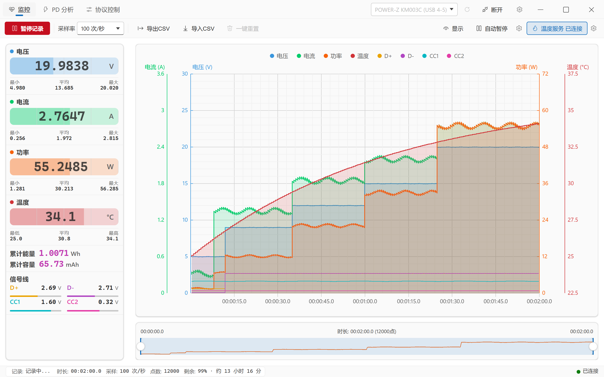
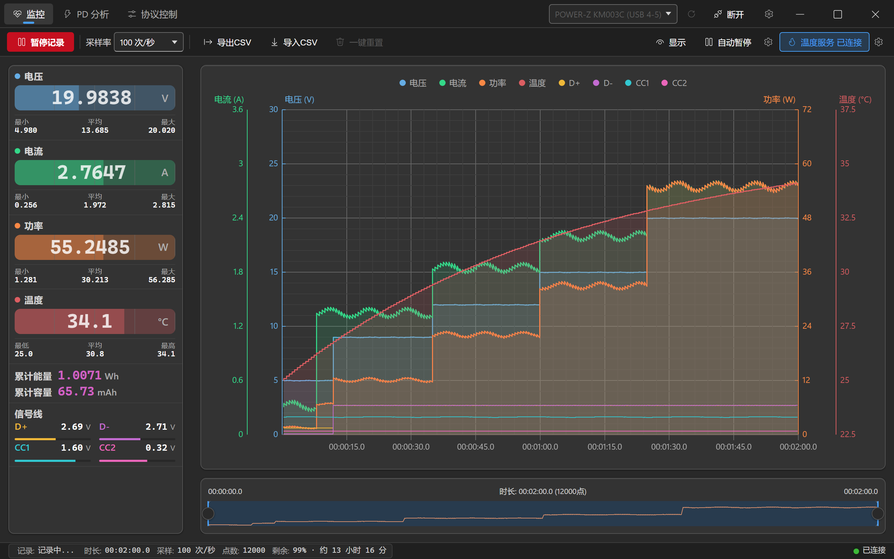
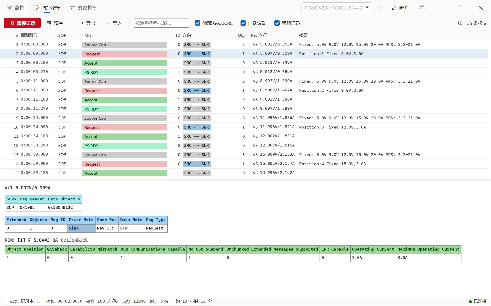
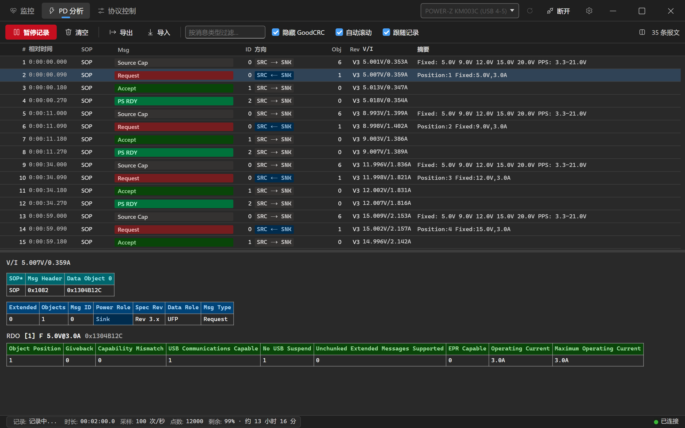
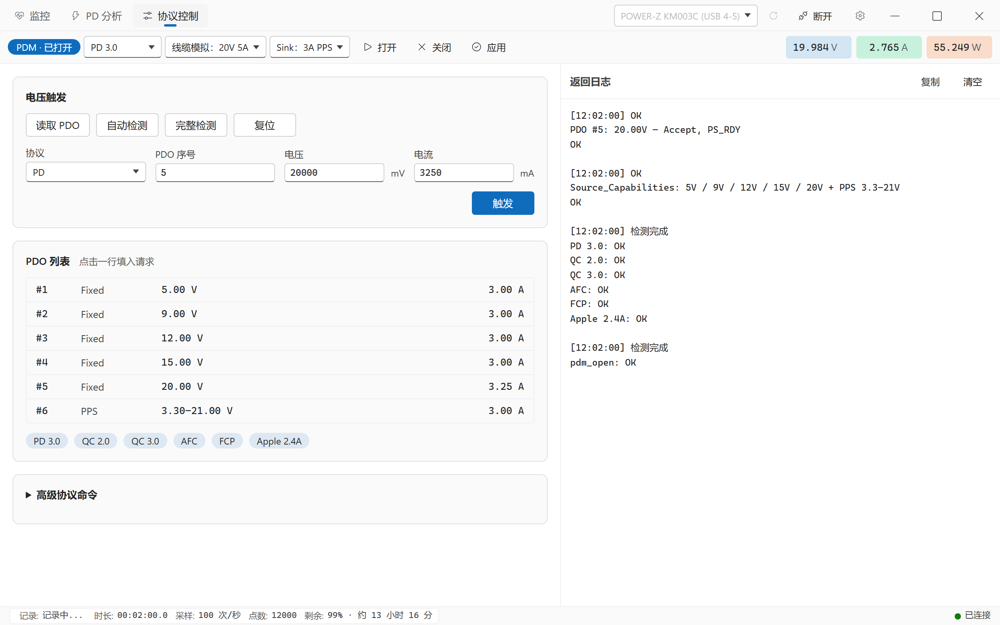
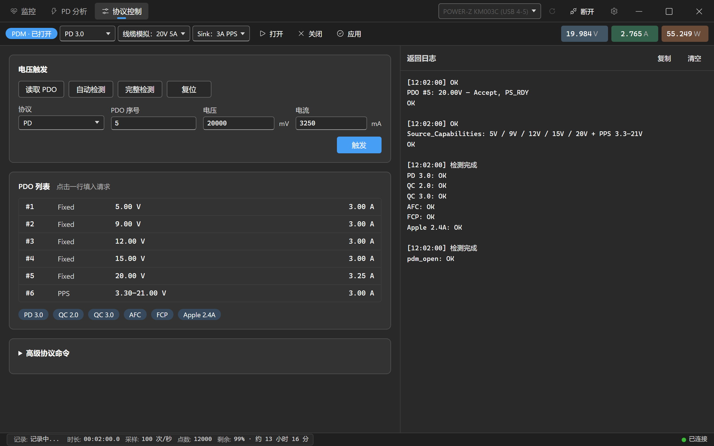
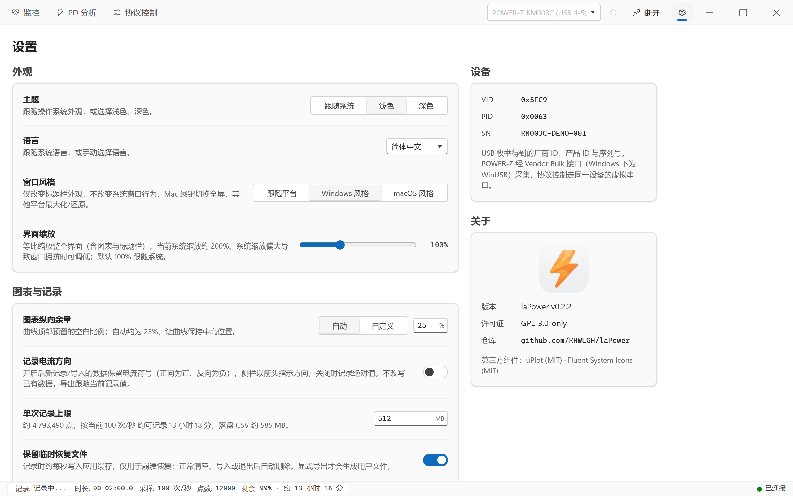
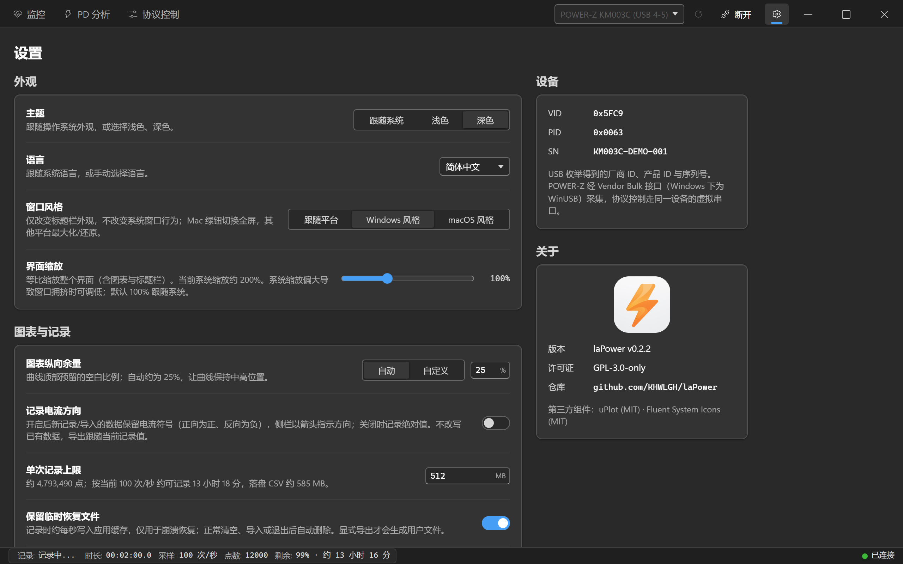

[English](README.md) | **简体中文** | [繁體中文](README.zh-TW.md) | [日本語](README.ja.md)

<div align="center">


# laPower

**维简 (WITRN) / POWER-Z USB 电压电流表的桌面上位机 —— 实时监控 · USB-PD 协议分析 · 数据记录**

[](https://github.com/KHWLGH/laPower/releases/latest)
[](https://github.com/KHWLGH/laPower/actions/workflows/ci.yml)
[](LICENSE)
[](https://github.com/KHWLGH/laPower/stargazers)
[](https://github.com/KHWLGH/laPower/releases)
[](https://github.com/KHWLGH/laPower/commits/main)

[](https://tauri.app/)
[](https://www.rust-lang.org/)
[](https://developer.mozilla.org/docs/Web/JavaScript)
[](https://github.com/leeoniya/uPlot)
[](#-下载与安装)

</div>

## 语言选择

在「设置 → 外观 → 语言」可选择跟随系统、简体中文、繁體中文、English、日本語。切换立即生效并保存偏好，保留连接、记录、数据、图表范围、筛选和选中报文；重置设置回到自动模式。

Linux 按第一项非空的 LC_ALL → LC_MESSAGES → LANG 检测；Windows／macOS 使用原生系统 locale。原生不可用时采用 WebView 首选语言，最终回退英文。Hans 优先选择简中、Hant 优先选择繁中；否则 CN／SG 和无区域 zh 为简中，TW／HK／MO 为繁中，ja 为日文，其余含 C／POSIX 为英文。统一处理大小写、下划线、编码与修饰后缀；手动选择覆盖自动检测。

```bash
LANG=en_US.UTF-8 ./laPower.AppImage
LC_ALL=ja_JP.UTF-8 ./laPower.AppImage
env -u LC_ALL LC_MESSAGES=zh_TW.UTF-8 LANG=en_US.UTF-8 ./laPower.AppImage
```

## 📖 项目简介

laPower 是一个连接维简 (WITRN) USB 电压电流表与 POWER-Z KM003C/KM002C 的桌面上位机。它通过 USB HID 或厂商 Bulk 接口读取测量帧，在本地完成实时显示、长时间记录与 USB-PD 协议解码，全程不需要网络。

技术上基于 **Tauri v2**：后端是 **Rust**（设备通信、USB-PD 解析、后台线程生命周期），前端源码是**原生 JavaScript ES Modules**，发布构建通过 esbuild 合并脚本和样式，图表用 uPlot。所有运行时前端依赖都已 vendor 进仓库，运行时不从 CDN 加载任何资源。

除了常规的电压 / 电流 / 功率 / 温度，laPower 还会记录 **D+ / D− / CC1 / CC2 四条信号线电压**，并把仪表捕获到的 **USB-PD 报文逐字段解码**：你可以直接看到充电器广播了哪些 PDO、设备请求了哪一档 PPS 电压、以及协商在第几毫秒完成。

> **平台说明：** 版本 Tag 通过 GitHub Actions 自动打包 Windows x64、Linux x64、macOS Intel / Apple Silicon，并在检查通过后发布 Release；下载以对应版本的实际附件为准。项目主要在 Windows 上开发与验证，macOS / Linux 的 GUI、设备连接和 macOS 12 兼容性仍需实机验收。构建与发布方式见 [开发与构建](docs/DEVELOPMENT.md#发布流程)。

> **提示：** 本软件大部分使用 Claude Code、Grok Build、Codex 等 VibeCoding 工具制作，可能存在未知问题。欢迎通过 [Issues](https://github.com/KHWLGH/laPower/issues) 反馈。

## 📸 界面预览

以下展示图使用独立开发工具生成的模拟设备与数据，保留软件完整标题栏，浅色主题优先展示。软件默认跟随系统，开发展示工具默认浅色。重新生成方法见 [开发展示工具](docs/DEVELOPMENT.md#开发展示工具)。

| 浅色主题 | 深色主题 |
| :---: | :---: |
| <br><sub>**监控** · 实时读数卡 / 8 通道 4 轴图表 / 时间线导航器</sub> | <br><sub>**监控** · 深色主题</sub> |
| <br><sub>**PD 分析** · 报文列表 / PDO 速览 / 逐字段解码</sub> | <br><sub>**PD 分析** · 深色主题</sub> |
| <br><sub>**协议控制** · PDM / PDO / 协议检测与电压触发</sub> | <br><sub>**协议控制** · 深色主题</sub> |
| <br><sub>**设置** · 外观 / 图表与记录 / 设备 / 关于</sub> | <br><sub>**设置** · 深色主题</sub> |

## ✨ 功能特性

### 实时监控

- 电压 / 电流 / 功率 / 温度读数卡，每项附最小值、最大值与平均值。
- **累计能量 (Wh) 与累计容量 (mAh)** 由软件对采样点积分得出。睡眠、时钟回拨或 NTP 前跳造成的时间跳变（超过采样间隔的 8 倍，且至少 2 秒）只按一个采样周期推进，不会污染积分结果。
- **信号线电压** D+ / D− / CC1 / CC2，可叠加到图表上，也随 CSV 一起导出；实际分辨率取决于设备，WITRN 的 CC1 / CC2 为 0.1 V。
- 可选**记录电流方向**：开启后保留电流符号（正向为正、反向为负，K2 原生支持 ±10 A），侧栏用箭头指示方向。
- **自动暂停**：当电压 / 电流 / 功率低于阈值并持续指定秒数后自动停止记录，适合无人值守的充放电测试。
- **POWER-Z 高速采样**：KM003C/KM002C 支持认证后的 AdcQueue 1000 次/秒采样；认证失败会自动回退到 100 次/秒。
- **临时恢复与上限**：记录按秒写入应用缓存中的临时文件，仅用于崩溃恢复；正常退出自动清理，单次记录默认上限 512 MB，达到上限自动暂停。显式导出才生成长期 CSV。

### USB-PD 协议分析

- 解码 SOP / SOP′ 的控制报文、数据报文、扩展报文，以及 Hard Reset / Cable Reset。
- 报文列表带角色方向徽章（`SRC → SNK`、`SRC|SNK → Plug`）和 **PDO / RDO 速览**，例如
  `Fixed: 5.0V 9.0V 12.0V 15.0V 20.0V SPR AVS: 9-15V@3.0A PPS: 5.0-21.0V` 或 `Position:7 PPS:8.0V,3.45A`。
- 详情面板把当前帧**逐字拆开**：原始 Data Object 十六进制 → 报文头字段表（Extended / Objects / Msg ID / Power Role / Spec Rev / Data Role / Msg Type）→ 每个 PDO 的完整位域表。
- 可过滤消息类型、隐藏 GoodCRC（链路层确认帧，通常占报文总量一半以上）。
- **跟随记录**模式让 PD 抓包与主监控完全联动：只在记录时采集、开始/暂停同步、清空互相联动。
- 报文日志可增长，配合虚拟列表在数十万条量级仍可流畅滚动。

### 高性能图表

- uPlot 绘制，**8 条曲线 / 4 条 Y 轴**（电流 A、电压 V、功率 W、温度 °C，四轴严格共线），另有两级密集子网格提升读数精度。
- 密集数据自动切换为增量 min/max 像素桶渲染，**百万点仍可拖动**；回看按画布实际像素分辨率保留细节，慢帧不会把曲线降成宽桶，放大后恢复原始点。完整数据保留在列式存储中，悬停时二分回查原始采样点。主图支持滚轮横向缩放，录制中也可使用。
- 1000 次/秒采样时自动绘图约 10–20 帧/秒，拖动与缩放独立刷新；采集与保存完整保留所有样本。录制和停止后的回看复用历史极值索引，缩小或平移窗口时无需重新扫描完整历史。验证范围及性能边界见 [性能说明](docs/PERFORMANCE.md#2026-10-04-高采样率窗口交互验收)。
- tooltip 同时显示全部 8 个通道，图例可逐通道开关，底部时间线导航器支持范围选取与拖动平移。
- 每条曲线的填充由不透明度直接控制（0 = 关闭填充，1–100 = 开启）。

### 数据记录与互通

- **CSV 导出**（可选是否含温度列）与**导入**；导入按表头名匹配列，兼容不含信号线列的旧文件。
- **PD 捕获导出 / 导入**，使用带版本号的 JSON 信封，旧版本格式仍可读取。
- 采样率 0.1 – 100 次/秒可选；POWER-Z 设备额外支持 1000 次/秒（后端接受 1 – 60000 ms，按设备限制）。

### 界面

- 多 Tab 工作区（监控 / PD 分析 / 协议控制 / 设置），设备连接常驻标题栏，任何页面都能快速连断；协议控制仅连接 POWER-Z 时显示。
- **跟随系统 / 浅色 / 深色**三种主题，默认跟随系统，设计令牌对齐 Fluent UI webDark / webLight。
- **界面缩放 50 – 200%**，系统缩放偏大导致窗口拥挤时可整体调低。
- 自定义无边框标题栏；Windows 上保留 Win11 贴靠布局浮窗。

## 📱 支持的设备

| 型号 | VID | PID |
| --- | --- | --- |
| WITRN K2 | `0x0716` | `0x5060` |
| WITRN U3 | `0x0716` | `0x5063`、`0x5044` |
| WITRN C5 | `0x0716` | `0x5053`、`0x5064` |
| POWER-Z KM003C | `0x5FC9` | `0x0063` |
| POWER-Z KM002C | `0x5FC9` | `0x0061` |

维简设备按厂商 VID `0x0716` 枚举，因此**不在上表中的型号或固件变体同样会出现在下拉框里**（显示为「未知 WITRN 设备 (0716:XXXX)」）。它们能否正常读数取决于固件是否使用相同的报告布局。POWER-Z 设备通过 `0x5FC9` 的 Vendor Bulk 接口单独枚举。

同一物理设备存在多个 HID 接口时，后端优先选择厂商自定义 Usage Page。设备名会附带 USB 拓扑端口，如 `WITRN K2 (USB 4-4)`。

## 📦 下载与安装

项目原名 WITRN-RS。laPower 的应用标识为 `io.github.khwlgh.lapower`，使用独立的设置与缓存目录，不自动迁移旧应用设置；已有 CSV 和 PD 捕获文件仍可导入。

**Windows 10 / 11 (x64)** —— 到 [Releases](https://github.com/KHWLGH/laPower/releases/latest) 下载 `.msi` 或 `.exe`（NSIS）安装包，安装后即可运行。维简仪表使用系统 USB HID；POWER-Z 使用系统 HID / WinUSB，Windows 通常会自动绑定，无需额外安装驱动。

Windows 安装包当前未做证书签名，首次运行可能显示 SmartScreen 提示。

**macOS 12+** —— Intel Mac 下载带 `macos-x64` 的 `.dmg`，Apple Silicon（M1 及以后）下载带 `macos-arm64` 的 `.dmg`，打开后将 `laPower.app` 拖到 Applications。应用采用 ad-hoc 签名，没有 Developer ID 签名或 Apple 公证；首次启动如果被 Gatekeeper 拦截，请在“系统设置 → 隐私与安全性”中允许本次打开。macOS 12 是构建目标，旧系统兼容性仍需实机验证；历史验证边界见 [macOS ARM64 构建记录](docs/MACOS_BUILD.md)。

**Linux (x64)** —— 下载带 `linux-x64` 的 `.deb`、`.rpm` 或 `.AppImage`。Debian / Ubuntu 可用 `sudo apt install ./laPower_<版本>_linux-x64.deb`；Fedora 等使用 RPM 的发行版可用 `sudo dnf install ./laPower_<版本>_linux-x64.rpm`。AppImage 先执行 `chmod +x ./laPower_<版本>_linux-x64.AppImage`，再直接运行；可能需要安装发行版的 FUSE 2 运行库。安装包基于 Ubuntu 22.04 构建，不承诺适用于所有发行版。

Linux 安装包不会自动修改设备权限。连接仪表前必须配置 [udev 规则](docs/DEVELOPMENT.md#udev-规则必需)，否则可能无法扫描或打开设备。Release 中的 `SHA256SUMS` 可用于校验七个安装包。

## 🚀 快速上手

1. **连接设备** —— 插入仪表，点击标题栏设备下拉框旁的刷新按钮扫描，选中目标设备后点击 `连接`。
2. **开始记录** —— 在「监控」Tab 点击 `开始记录`。读数卡与图表立即开始更新，累计能量与容量同步积分（暂停期间不计入）。
3. **抓 PD 报文** —— 切到「PD 分析」Tab。默认开启 `跟随记录`，与主监控同步启停；**插拔充电器时的握手过程信息量最大**。
4. **导出数据** —— 回到「监控」Tab，`导出CSV` 选择 `带温度` 或 `不带温度`；PD 报文在「PD 分析」Tab 用 `导出` 单独保存为 JSON。

完整的界面说明、每一项设置的含义与文件格式，见 [使用指南](docs/USAGE.md)。

## 📚 文档

| 文档 | 内容 |
| --- | --- |
| [使用指南](docs/USAGE.md) | 界面逐项说明、全部设置项、CSV 与 PD 捕获文件格式、常见问题 |
| [技术架构](docs/ARCHITECTURE.md) | 线程模型、Tauri 命令、数据流、HID 报文布局、测试与安全边界 |
| [开发与构建](docs/DEVELOPMENT.md) | 环境要求、构建命令、CI 门禁、Linux / macOS 自行编译、参与贡献 |
| [macOS ARM64 构建记录](docs/MACOS_BUILD.md) | Apple Silicon 打包步骤、ad-hoc 签名、DMG 与验收边界 |
| [性能基准与边界](docs/PERFORMANCE.md) | 图表调度、数据完整性、性能测量与真机验收记录 |
| [外部温度服务](docs/TEMPERATURE.md) | TCP 温度源协议、应用内配置、Python 示例服务器 |
| [更新日志](CHANGELOG.md) | 完整版本历史 |

## 🙏 致谢与相关项目

- 感谢 WITRN、POWER-Z 提供的 USB-PD 采集硬件支持。
- 感谢[JohnScotttt](https://github.com/JohnScotttt)的WITRN HID实现。
- 感谢 [km003c-protocol-research](https://github.com/okhsunrog/km003c-protocol-research) 对 POWER-Z Bulk、认证与 AdcQueue 协议的公开研究。
- 感谢所有开源项目贡献者。

### 协议库

工作区里的协议 crate 都是独立的 Rust 库（`publish = false`），不依赖 Tauri：

- **`crates/witrn-hid`** —— WITRN HID 设备封装与测量帧解析。
- **`crates/usbpd-parser`** —— USB-PD 报文解码与字段树。
- **`crates/km003c`** —— POWER-Z Vendor Bulk、AES 认证、AdcQueue 与 CDC 控制。

## 📄 许可证

本项目采用分层许可：

| 组件 | 许可证 |
| --- | --- |
| 应用本体（`src-tauri`、`src`） | [GPL-3.0-only](LICENSE) |
| 协议库 `crates/usbpd-parser`、`crates/witrn-hid`、`crates/km003c` | LGPL-3.0-or-later |

协议 crate 采用 LGPL 便于被其他项目复用。仓库根目录的 [`LICENSE`](LICENSE) 是 GPLv3 全文；LGPL-3.0 的完整文本请参阅 [GNU 官方页面](https://www.gnu.org/licenses/lgpl-3.0)。

第三方组件：uPlot (MIT) · Fluent System Icons (MIT)

## 🔗 相关链接

- [提交 Issue 或建议](https://github.com/KHWLGH/laPower/issues)
- [维简 (WITRN) 官方网站](https://www.witrn.com/)
- [Tauri 官方文档](https://tauri.app/)
- [Rust 官方网站](https://www.rust-lang.org/)
