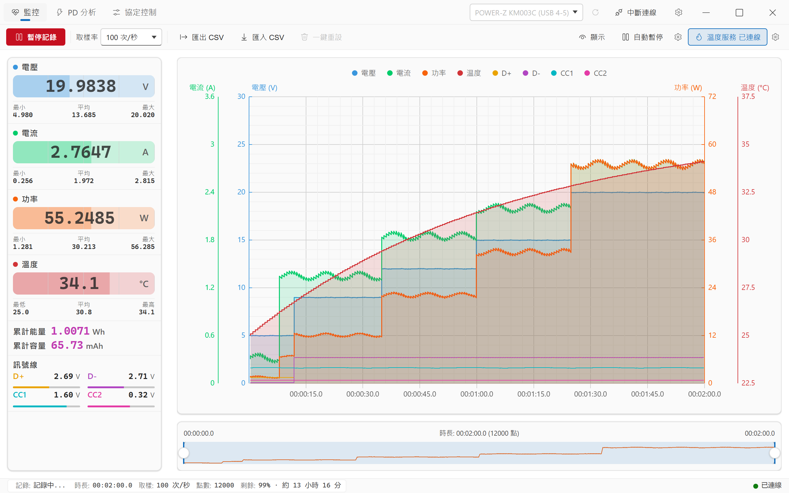
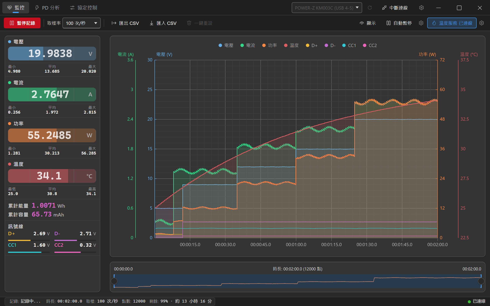
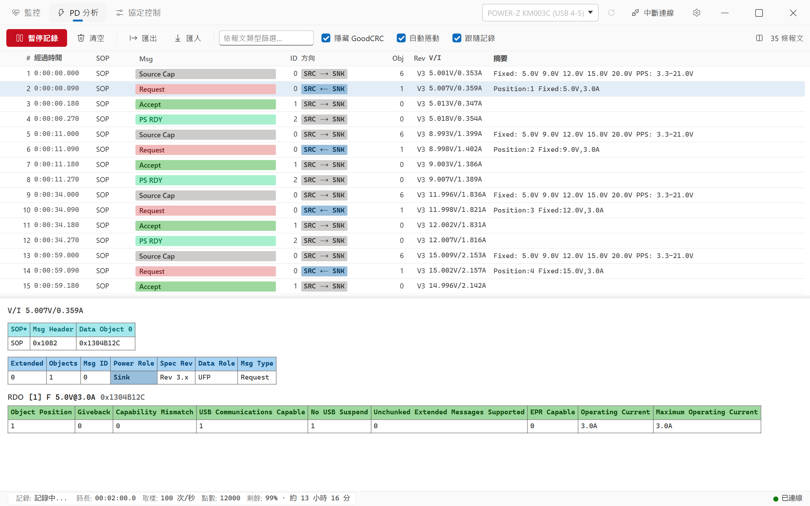
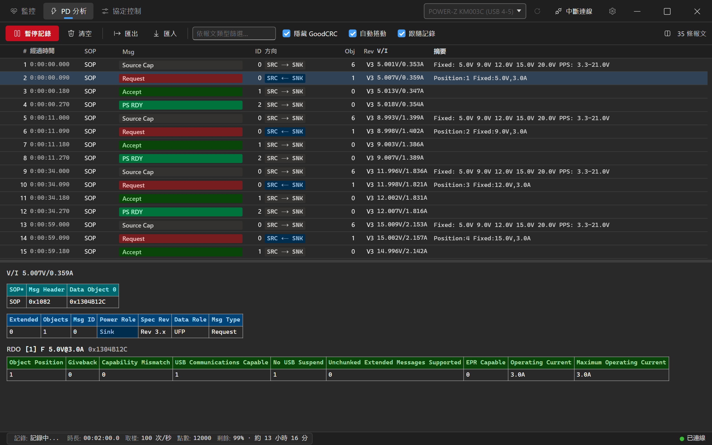
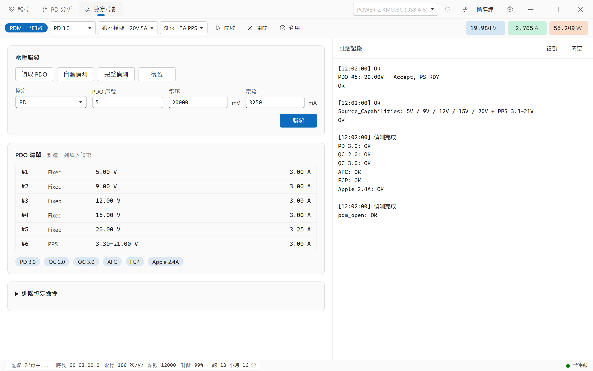
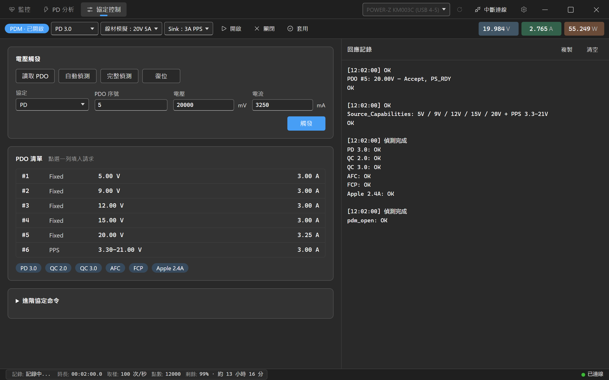
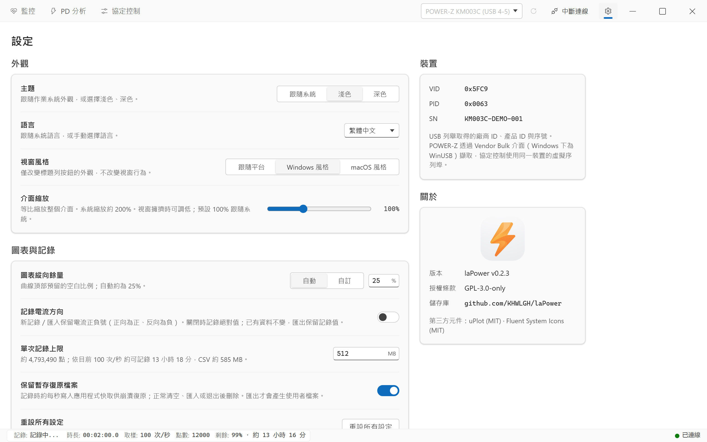
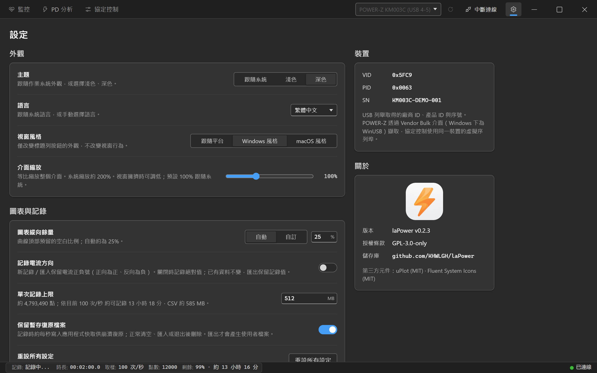

[English](README.md) | [简体中文](README.zh-CN.md) | **繁體中文** | [日本語](README.ja.md)

<div align="center">


# laPower

**維簡 (WITRN) / POWER-Z USB 電壓電流表的桌面上位機 —— 即時監控 · USB-PD 協定分析 · 資料記錄**

[](https://github.com/KHWLGH/laPower/releases/latest)
[](https://github.com/KHWLGH/laPower/actions/workflows/ci.yml)
[](LICENSE)
[](https://github.com/KHWLGH/laPower/stargazers)
[](https://github.com/KHWLGH/laPower/releases)
[](https://github.com/KHWLGH/laPower/commits/main)

[](https://tauri.app/)
[](https://www.rust-lang.org/)
[](https://developer.mozilla.org/docs/Web/JavaScript)
[](https://github.com/leeoniya/uPlot)
[](#-下載與安裝)

</div>

## 語言選擇

在「設定 → 外觀 → 語言」可選擇跟隨系統、简体中文、繁體中文、English、日本語。切換立即生效並儲存偏好，保留連線、記錄、資料、圖表範圍、篩選和選中報文；重設設定回到自動模式。

Linux 按第一項非空的 LC_ALL → LC_MESSAGES → LANG 偵測；Windows／macOS 使用原生系統 locale。原生不可用時採用 WebView 首選語言，最終回退英文。Hans 優先選擇簡中、Hant 優先選擇繁中；否則 CN／SG 和無區域 zh 為簡中，TW／HK／MO 為繁中，ja 為日文，其餘含 C／POSIX 為英文。統一處理大小寫、下劃線、編碼與修飾後綴；手動選擇覆蓋自動偵測。

```bash
LANG=en_US.UTF-8 ./laPower.AppImage
LC_ALL=ja_JP.UTF-8 ./laPower.AppImage
env -u LC_ALL LC_MESSAGES=zh_TW.UTF-8 LANG=en_US.UTF-8 ./laPower.AppImage
```

## 📖 專案簡介

laPower 是一個連線維簡 (WITRN) USB 電壓電流表與 POWER-Z KM003C/KM002C 的桌面上位機。它通過 USB HID 或廠商 Bulk 介面讀取測量訊框，在本地完成即時顯示、長時間記錄與 USB-PD 協定解碼，全程不需要網路。

技術上基於 **Tauri v2**：後端是 **Rust**（裝置通信、USB-PD 解析、背景執行緒生命週期），前端源碼是**原生 JavaScript ES Modules**，發佈建置通過 esbuild 合併指令碼和樣式，圖表用 uPlot。所有運行時前端依賴都已 vendor 進儲存庫，運行時不從 CDN 載入任何資源。

除了常規的電壓 / 電流 / 功率 / 溫度，laPower 還會記錄 **D+ / D− / CC1 / CC2 四條訊號線電壓**，並把儀表擷取到的 **USB-PD 報文逐欄位解碼**：你可以直接看到充電器廣播了哪些 PDO、裝置請求了哪一檔 PPS 電壓、以及協商在第幾毫秒完成。

> **平台說明：** 版本 Tag 通過 GitHub Actions 自動打包 Windows x64、Linux x64、macOS Intel / Apple Silicon，並在檢查通過後發佈 Release；下載以對應版本的實際附件為準。專案主要在 Windows 上開發與驗證，macOS / Linux 的 GUI、裝置連線和 macOS 12 相容性仍需實機驗收。建置與發佈方式見 [開發與建置](docs/zh-TW/DEVELOPMENT.md#發佈流程)。

> **提示：** 本軟體大部分使用 Claude Code、Grok Build、Codex 等 VibeCoding 工具製作，可能存在未知問題。歡迎通過 [Issues](https://github.com/KHWLGH/laPower/issues) 回報。

## 📸 介面預覽

以下展示圖為 Windows 上的 **0.2.3** 版本，使用獨立開發工具產生的模擬裝置與資料，保留軟體完整標題列，淺色主題優先展示。軟體預設跟隨系統，開發展示工具預設淺色。重新產生方法見 [開發展示工具](docs/zh-TW/DEVELOPMENT.md#開發展示工具)。

| 淺色主題 | 深色主題 |
| :---: | :---: |
| <br><sub>**監控** · 即時讀數卡 / 8 通道 4 軸圖表 / 時間線導航器</sub> | <br><sub>**監控** · 深色主題</sub> |
| <br><sub>**PD 分析** · 報文清單 / PDO 速覽 / 逐欄位解碼</sub> | <br><sub>**PD 分析** · 深色主題</sub> |
| <br><sub>**協定控制** · PDM / PDO / 協定偵測與電壓觸發</sub> | <br><sub>**協定控制** · 深色主題</sub> |
| <br><sub>**設定** · 外觀 / 圖表與記錄 / 裝置 / 關於</sub> | <br><sub>**設定** · 深色主題</sub> |

## ✨ 功能特性

### 即時監控

- 電壓 / 電流 / 功率 / 溫度讀數卡，每項附最小值、最大值與平均值。
- **累計能量 (Wh) 與累計容量 (mAh)** 由軟體對取樣點積分得出。睡眠、時鐘回撥或 NTP 前跳造成的時間跳變（超過取樣間隔的 8 倍，且至少 2 秒）只按一個取樣週期推進，不會汙染積分結果。
- **訊號線電壓** D+ / D− / CC1 / CC2，可疊加到圖表上，也隨 CSV 一起匯出；實際解析度取決於裝置，WITRN 的 CC1 / CC2 為 0.1 V。
- 可選**記錄電流方向**：開啟後保留電流符號（正向為正、反向為負，K2 原生支援 ±10 A），側欄用箭頭指示方向。
- **自動暫停**：當電壓 / 電流 / 功率低於閾值並持續指定秒數後自動暫停記錄，適合無人值守的充放電測試。
- **POWER-Z 高速取樣**：KM003C/KM002C 支援認證後的 AdcQueue 1000 次/秒取樣；認證失敗會自動回退到 100 次/秒。
- **暫存復原與上限**：記錄按秒寫入應用快取中的暫存檔案，僅用於崩潰復原；正常退出自動清理，單次記錄預設上限 512 MB，達到上限自動暫停。顯式匯出才產生長期 CSV。

### USB-PD 協定分析

- 解碼 SOP / SOP′ 的控制報文、資料報文、擴充報文，以及 Hard Reset / Cable Reset。
- 報文清單帶角色方向徽章（`SRC → SNK`、`SRC|SNK → Plug`）和 **PDO / RDO 速覽**，例如
  `Fixed: 5.0V 9.0V 12.0V 15.0V 20.0V SPR AVS: 9-15V@3.0A PPS: 5.0-21.0V` 或 `Position:7 PPS:8.0V,3.45A`。
- 詳情面板把當前訊框**逐字拆開**：原始 Data Object 十六進位 → 報文頭欄位表（Extended / Objects / Msg ID / Power Role / Spec Rev / Data Role / Msg Type）→ 每個 PDO 的完整位域表。
- 可篩選訊息類型、隱藏 GoodCRC（鏈路層確認訊框，通常佔報文總量一半以上）。
- **跟隨記錄**模式讓 PD 抓包與主監控完全聯動：只在記錄時擷取、開始/暫停同步、清空互相聯動。
- 報文記錄可增長，配合虛擬清單在數十萬條量級仍可流暢捲動。

### 高效能圖表

- uPlot 繪製，**8 條曲線 / 4 條 Y 軸**（電流 A、電壓 V、功率 W、溫度 °C，四軸嚴格共線），另有兩級密集子網格提升讀數精度。
- 密集資料自動切換為增量 min/max 像素桶渲染，**百萬點仍可拖動**；回看按畫布實際像素解析度保留細節，慢影格不會把曲線降成寬桶，放大後恢復原始點。完整資料保留在列式存儲中，懸停時二分回查原始取樣點。主圖支援滾輪橫向縮放，錄製中也可使用。
- 1000 次/秒取樣時自動繪圖約 10–20 影格/秒，拖動與縮放獨立更新；擷取與儲存完整保留所有樣本。錄製和停止後的回看共用歷史極值索引，縮小或平移視窗時無需重新掃描完整歷史。驗證範圍及效能邊界見 [效能說明](docs/PERFORMANCE.md#2026-10-04-高采样率窗口交互验收)（簡體中文）。
- tooltip 同時顯示全部 8 個通道，圖例可逐通道開關，底部時間線導航器支援範圍選取與拖動平移。
- 每條曲線的填充由不透明度直接控制（0 = 關閉填充，1–100 = 開啟）。

### 資料記錄與互通

- **CSV 匯出**（可選是否含溫度列）與**匯入**；匯入按表頭名匹配列，相容不含訊號線列的舊檔案。
- **PD 擷取匯出 / 匯入**，使用帶版本號的 JSON 信封，舊版本格式仍可讀取。
- 取樣率 0.1 – 100 次/秒可選；POWER-Z 裝置額外支援 1000 次/秒（後端接受 1 – 60000 ms，按裝置限制）。

### 介面

- 多 Tab 工作區（監控 / PD 分析 / 協定控制 / 設定），裝置連線常駐標題列，任何頁面都能快速連線或中斷連線；協定控制僅連線 POWER-Z 時顯示。
- **跟隨系統 / 淺色 / 深色**三種主題，預設跟隨系統，設計令牌對齊 Fluent UI webDark / webLight。
- **介面縮放 50 – 200%**，系統縮放偏大導致視窗擁擠時可整體調低。
- macOS 使用原生視窗按鈕，支援全螢幕、平鋪與最小化；Windows 保留 Win11 貼齊版面配置浮窗，Windows / Linux 可切換 Windows 與 macOS 按鈕外觀。

## 📱 支援的裝置

| 型號 | VID | PID |
| --- | --- | --- |
| WITRN K2 | `0x0716` | `0x5060` |
| WITRN U3 | `0x0716` | `0x5063`、`0x5044` |
| WITRN C5 | `0x0716` | `0x5053`、`0x5064` |
| POWER-Z KM003C | `0x5FC9` | `0x0063` |
| POWER-Z KM002C | `0x5FC9` | `0x0061` |

維簡裝置按廠商 VID `0x0716` 列舉，因此**不在上表中的型號或韌體變體同樣會出現在下拉框裡**（顯示為「未知 WITRN 裝置 (0716:XXXX)」）。它們能否正常讀數取決於韌體是否使用相同的報告結構。POWER-Z 裝置通過 `0x5FC9` 的 Vendor Bulk 介面單獨列舉。

同一物理裝置存在多個 HID 介面時，後端優先選擇廠商自訂 Usage Page。裝置名會附帶 USB 拓撲連接埠，如 `WITRN K2 (USB 4-4)`。

## 📦 下載與安裝

專案原名 WITRN-RS。laPower 的應用標識為 `io.github.khwlgh.lapower`，使用獨立的設定與快取目錄，不自動遷移舊應用設定；已有 CSV 和 PD 擷取檔案仍可匯入。

**Windows 10 / 11 (x64)** —— 到 [Releases](https://github.com/KHWLGH/laPower/releases/latest) 下載 `.msi` 或 `.exe`（NSIS）安裝包，安裝後即可運行。維簡儀表使用系統 USB HID；POWER-Z 使用系統 HID / WinUSB，Windows 通常會自動綁定，無需額外安裝驅動。

Windows 安裝包當前未做憑證簽章，首次運行可能顯示 SmartScreen 提示。

**macOS 12+** —— Intel Mac 下載帶 `macos-x64` 的 `.dmg`，Apple Silicon（M1 及以後）下載帶 `macos-arm64` 的 `.dmg`，開啟後將 `laPower.app` 拖到 Applications。應用採用 ad-hoc 簽章，沒有 Developer ID 簽章或 Apple 公證；首次啟動如果被 Gatekeeper 攔截，請在“系統設定 → 隱私與安全性”中允許本次開啟。macOS 12 是建置目標，舊系統相容性仍需實機驗證；歷史驗證邊界見 [macOS ARM64 建置記錄](docs/MACOS_BUILD.md)（簡體中文）。

**Linux (x64)** —— 下載帶 `linux-x64` 的 `.deb`、`.rpm` 或 `.AppImage`。Debian / Ubuntu 可用 `sudo apt install ./laPower_<版本>_linux-x64.deb`；Fedora 等使用 RPM 的發行版可用 `sudo dnf install ./laPower_<版本>_linux-x64.rpm`。AppImage 先執行 `chmod +x ./laPower_<版本>_linux-x64.AppImage`，再直接運行；可能需要安裝發行版的 FUSE 2 運行庫。安裝包基於 Ubuntu 22.04 建置，不承諾適用於所有發行版。

Linux 安裝包不會自動修改裝置權限。連線儀表前必須設定 [udev 規則](docs/zh-TW/DEVELOPMENT.md#udev-規則必需)，否則可能無法掃描或開啟裝置。Release 中的 `SHA256SUMS` 可用於校驗七個安裝包。

## 🚀 快速上手

1. **連線裝置** —— 插入儀表，點選標題列裝置下拉框旁的重新整理按鈕掃描，選中目標裝置後點選 `連線`。
2. **開始記錄** —— 在「監控」Tab 點選 `開始記錄`。讀數卡與圖表立即開始更新，累計能量與容量同步積分（暫停期間不計入）。
3. **抓 PD 報文** —— 切到「PD 分析」Tab。預設開啟 `跟隨記錄`，與主監控同步啟停；**插拔充電器時的握手過程資訊量最大**。
4. **匯出資料** —— 回到「監控」Tab，`匯出 CSV` 選擇 `含溫度` 或 `不含溫度`；PD 報文在「PD 分析」Tab 用 `匯出` 單獨儲存為 JSON。

完整的介面說明、每一項設定的含義與檔案格式，見 [使用指南](docs/zh-TW/USAGE.md)。

## 📚 文件

| 文件 | 內容 |
| --- | --- |
| [使用指南](docs/zh-TW/USAGE.md) | 介面逐項說明、全部設定項、CSV 與 PD 擷取檔案格式、常見問題 |
| [技術架構](docs/ARCHITECTURE.md)（簡體中文） | 執行緒模型、Tauri 命令、資料流、HID 報文佈局、測試與安全邊界 |
| [開發與建置](docs/zh-TW/DEVELOPMENT.md) | 環境要求、建置命令、CI 門禁、Linux / macOS 自行編譯、參與貢獻 |
| [macOS ARM64 建置記錄](docs/MACOS_BUILD.md)（簡體中文） | Apple Silicon 打包步驟、ad-hoc 簽章、DMG 與驗收邊界 |
| [效能基準與邊界](docs/PERFORMANCE.md)（簡體中文） | 圖表調度、資料完整性、效能測量與真機驗收記錄 |
| [外部溫度服務](docs/zh-TW/TEMPERATURE.md) | TCP 溫度源協定、應用內設定、Python 示例伺服器 |
| [更新記錄](CHANGELOG.md)（簡體中文） | 完整版本歷史 |

## 🙏 致謝與相關專案

- 感謝 WITRN、POWER-Z 提供的 USB-PD 擷取硬體支援。
- 感謝[JohnScotttt](https://github.com/JohnScotttt)的WITRN HID實現。
- 感謝 [km003c-protocol-research](https://github.com/okhsunrog/km003c-protocol-research) 對 POWER-Z Bulk、認證與 AdcQueue 協定的公開研究。
- 感謝所有開源專案貢獻者。

### 協定庫

工作區裡的協定 crate 都是獨立的 Rust 庫（`publish = false`），不依賴 Tauri：

- **`crates/witrn-hid`** —— WITRN HID 裝置封裝與測量訊框解析。
- **`crates/usbpd-parser`** —— USB-PD 報文解碼與欄位樹。
- **`crates/km003c`** —— POWER-Z Vendor Bulk、AES 認證、AdcQueue 與 CDC 控制。

## 📄 授權條款

本專案採用分層許可：

| 組件 | 授權條款 |
| --- | --- |
| 應用本體（`src-tauri`、`src`） | [GPL-3.0-only](LICENSE) |
| 協定庫 `crates/usbpd-parser`、`crates/witrn-hid`、`crates/km003c` | LGPL-3.0-or-later |

協定 crate 採用 LGPL 便於被其他專案共用。儲存庫根目錄的 [`LICENSE`](LICENSE) 是 GPLv3 全文；LGPL-3.0 的完整文字請參閱 [GNU 官方頁面](https://www.gnu.org/licenses/lgpl-3.0)。

第三方元件：uPlot (MIT) · Fluent System Icons (MIT)

## 🔗 相關鏈接

- [提交 Issue 或建議](https://github.com/KHWLGH/laPower/issues)
- [維簡 (WITRN) 官方網站](https://www.witrn.com/)
- [Tauri 官方文件](https://tauri.app/)
- [Rust 官方網站](https://www.rust-lang.org/)
